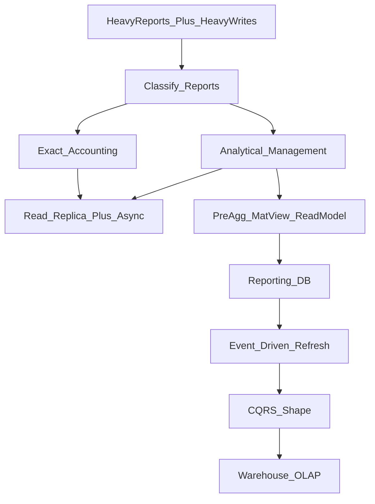

# Odoo Heavy Reporting Scale

Architecture pack for Odoo/POS environments with ~**200M** `account.move.line` rows, **50+** concurrent report users, and **20+** branches—where indexes and SQL tuning are already in place, but heavy reports still contend with writes (POS/checkout).

## Verdict

Do **not** start with CQRS or partitioning `account.move.line`.

Highest ROI path:

1. **Split reports** into Exact Accounting vs Analytical
2. **Isolate** reporting load from Odoo writes (replica + async + connection limits)
3. **Shrink** analytical reads via pre-aggregation / read models
4. Only then evolve: Reporting DB → event-driven refresh → CQRS-shaped architecture → warehouse if BI outgrows it

## Scenario assumptions

| Factor | Value |
|--------|--------|
| Hot table | `account.move.line` (~200M rows) |
| Users | 50+ concurrent report consumers |
| Org | 20+ branches / companies |
| Already done | Indexing, obvious SQL tuning |
| Pain | Reports slow + POS/write latency under concurrent load |

## Core decision: two report lanes

| Lane | Examples | Consistency | Allowed solutions |
|------|----------|-------------|-------------------|
| **Exact Accounting** | Trial balance, GL, partner ledger, tax/ZATCA, statutory closes | Must match Odoo ledger (near real-time or controlled as-of) | Replica, async export, connection limits; careful partitioning/archive later |
| **Analytical / Management** | Branch KPIs, daily sales, dashboards, trends, cross-branch P&L | Eventual consistency OK (minutes–hours) | Pre-agg, matviews, read models, reporting DB, events, CQRS, warehouse |

Mixing both on one path forces either unsafe lag on statutory reports or unnecessary cost on management reports.

## What each class of solution buys you

| Class | Examples | What it actually does |
|-------|----------|------------------------|
| Workload isolation | Replica, separate server, connection caps | Stops reports from choking POS/writes; does **not** make a 200M scan cheap |
| Data reduction | Pre-agg, matview, read model, archive, warehouse | Makes 200M feel like thousands |
| UX relief | Async + workers + cache | Stops users waiting on HTTP; query cost may stay the same |
| Architecture | CQRS / events | Enablement so isolation + reduction stay maintainable—not magic alone |

## Phased roadmap (do in order)

| Phase | Focus | Exit criterion |
|-------|--------|----------------|
| **0** Measure & classify | Inventory reports, baselines, SLAs, Exact vs Analytical | Prioritized list + lane assignment + timings |
| **1** Protect writes | Replica, separate reporting host, pooling, concurrency caps, async PDF/Excel | POS/write stable under concurrent report load |
| **2** Shrink analytical reads | Daily/hourly summaries, matviews/scheduled agg, targeted cache | Top N analytical reports read summaries, not raw AML |
| **3** Reporting DB + read model | Dedicated facts/dims; analytical off primary | Analytical workload off Odoo primary |
| **4** Event-driven refresh | Incremental updates + nightly reconcile | Analytical freshness meets SLA |
| **5** Explicit CQRS | Formalize commands vs queries when complexity demands | Clear ownership across consumers/teams |
| **6** Warehouse / OLAP | Cross-domain BI, long history, external tools | Only when Phase 2–4 stop being enough |

Details and checklists: [`docs/phase-checklists.md`](docs/phase-checklists.md).

## Explicit non-goals early

- Partitioning `account.move.line` first (high Odoo ORM/FK/upgrade risk)
- Full CQRS rewrite of Odoo writes (keep Odoo as write model)
- Treating async as “faster queries” (UX only unless paired with aggregation)
- Archiving via naive `DELETE` on AML (legal/audit/ZATCA first; prefer cold storage)
- One architecture for all reports

## Docs in this pack

| Doc | Purpose |
|-----|---------|
| [`docs/report-classification.md`](docs/report-classification.md) | Template: Exact vs Analytical inventory + SLAs |
| [`docs/phase-0-baseline.md`](docs/phase-0-baseline.md) | Measurement SQL, inventory worksheet, SLA defaults |
| [`docs/phase-1-isolation.md`](docs/phase-1-isolation.md) | Replica + reporting host + pooling/caps + async jobs |
| [`docs/phase-2-preaggregation.md`](docs/phase-2-preaggregation.md) | Summary grains, refresh jobs, cache, reconcile |
| [`docs/phase-3-reporting-db.md`](docs/phase-3-reporting-db.md) | Reporting DB facts/dims, sync options, cutover |
| [`docs/phase-4-events-and-beyond.md`](docs/phase-4-events-and-beyond.md) | Events, CQRS formalization, warehouse, archive caveats |
| [`docs/solutions-catalog.md`](docs/solutions-catalog.md) | All 22 solutions: when / why / risk / phase |
| [`docs/target-architecture.md`](docs/target-architecture.md) | Steady-state diagrams + consistency rules |
| [`docs/phase-checklists.md`](docs/phase-checklists.md) | Per-phase work items and exit criteria |

## Learn in the browser

Open [`learn.html`](learn.html) — interactive bilingual guide (AR/EN) covering all 22 solutions, trade-offs, Exact vs Analytical lanes, and the recommended order.

## Implementation (`phases/`)

Runnable SQL, configs, and job stubs for **all phases 0–6**:

| Phase | Path |
|-------|------|
| 0 Baseline | [`phases/00-baseline/`](phases/00-baseline/) |
| 1 Isolation | [`phases/01-isolation/`](phases/01-isolation/) |
| 2 Pre-aggregation | [`phases/02-preaggregation/`](phases/02-preaggregation/) |
| 3 Reporting DB | [`phases/03-reporting-db/`](phases/03-reporting-db/) |
| 4 Events | [`phases/04-events/`](phases/04-events/) |
| 5 CQRS routing | [`phases/05-cqrs/`](phases/05-cqrs/) |
| 6 Warehouse | [`phases/06-warehouse/`](phases/06-warehouse/) |

See [`phases/README.md`](phases/README.md). Copy `phases/shared/config.example.env` → `config.env`, adapt `reporting.branch_id`, then execute in order.

## Next step

Start with **Phase 0** measurement on a live DB, then Phase 1 isolation, then Phase 2 summary install on the replica.
