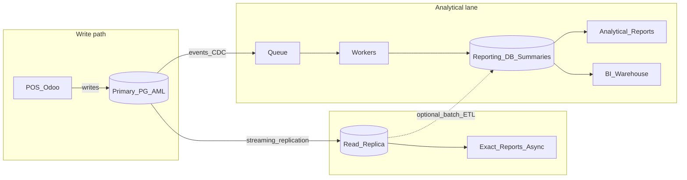

# Target architecture

Steady-state shape for Odoo heavy reporting with two lanes. Evolve into this; do not build all layers on day one.

## Steady-state diagram

```text
POS / Odoo ──writes──► Primary PostgreSQL (account.move.line)
                              │
                              ├── streaming / events / CDC ──► Queue ──► Workers
                              │                                      │
                              └── physical replica ──► Exact reports / exports
                                                         │
                                                         ▼
                                              Reporting DB + summaries
                                                         │
                                              ┌──────────┴──────────┐
                                              ▼                     ▼
                                     Analytical Odoo reports      BI / Warehouse
```



## Lane rules

### Exact Accounting

| Rule | Detail |
|------|--------|
| Source of truth | Odoo primary schema (`account.move*`, etc.) |
| Preferred read path | Low-lag physical replica; primary only when lag SLA fails or for critical closes |
| Consistency | Near real-time or controlled **as-of** with documented lag ceiling |
| Delivery | Prefer async PDF/Excel; never block POS on long HTTP |
| Concurrency | Hard caps + pooling |
| Forbidden | Serving statutory/tax from unverified pre-agg or reporting DB |

### Analytical / Management

| Rule | Detail |
|------|--------|
| Source of truth for UX | Read model / summaries (with reconcile back to Odoo) |
| Preferred read path | Pre-agg → Reporting DB; not raw AML |
| Consistency | Eventual; show **as of** timestamp on every dashboard/report |
| Delivery | Async or cached; events for incremental refresh when SLA needs it |
| Forbidden | Pretending ledger parity without reconciliation evidence |

## Consistency contracts

| Concern | Exact | Analytical |
|---------|-------|------------|
| User-visible freshness | Lag ≤ N seconds or refuse/fall back | ≤ SLA (e.g. 15 min) |
| Drift handling | Alert on replica lag; do not serve if over policy | Nightly reconcile; alert on drift beyond tolerance |
| “As of” | Optional (period end / snapshot time) | **Required** |
| Failure mode | Queue backlog, slower exports—not wrong books | Slightly stale KPIs—not blocked POS |

## Phase evolution (what appears when)

| Phase | What you add |
|-------|----------------|
| 1 | Replica + reporting workers host + pool/caps + async exact/analytical exports |
| 2 | Summary tables / matviews on replica (or side schema); analytical reports point at them |
| 3 | Dedicated Reporting DB; facts/dims; ETL/CDC from primary or replica |
| 4 | Domain events → queue → incremental summary updates; nightly reconcile |
| 5 | Explicit CQRS ownership: commands = Odoo; queries = read models |
| 6 | Warehouse/OLAP for cross-domain BI beyond Odoo |

## Suggested analytical grain (Phase 2+)

Start simple; widen only when reports demand it:

| Grain | Example use |
|-------|-------------|
| `date × company × branch × account` | Branch P&L / account rollups |
| `date × company × branch × product` | Sales / margin KPIs |
| Optional hourly for “today” | Wallboards during business hours |

Keep Exact reports on ledger lines; do not force AML grain into the analytical path.

## Example Reporting DB shapes (Phase 3)

Illustrative only—design from classified reports:

```text
dim_company, dim_branch, dim_account, dim_product, dim_date
fact_aml_daily      — balances / movement at chosen grain
fact_sales_daily    — qty, amount, margin by product/branch
meta_refresh        — last_success_at, source_watermark, job status
```

Exact Accounting continues against Odoo schema on primary/replica unless you can **prove** ledger parity for a specific report.

## Event-driven refresh (Phase 4)

```text
Invoice posted / Payment posted / POS order done
        → domain event
        → queue
        → worker updates summary / reporting DB
        → dashboard reads projection (“as of” = last applied event / job time)

Nightly: full or windowed reconcile (Odoo aggregates vs read model) → alert on mismatch
```

Do not introduce events before a read model exists; events maintain summaries, they do not invent them.

## CQRS shape (Phase 5 — formalization)

| Side | System |
|------|--------|
| Commands (writes) | Odoo / POS → primary PostgreSQL |
| Queries (reads) | Reporting DB / summaries / BI |
| Sync | Events + batch ETL + reconcile |

This is **CQRS as data separation**, not a rewrite of Odoo’s write path.

## Non-goals in the target picture

- Partitioning AML as the primary performance strategy
- Deleting AML rows as “archive”
- One shared query path for trial balance and branch KPI dashboards
- Warehouse before summaries + reporting DB have been exhausted
