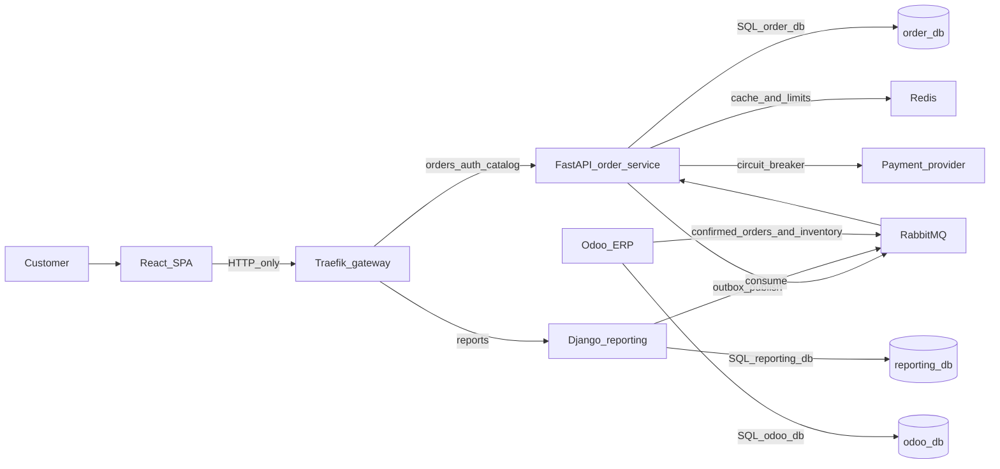

# Commerce platform (learning project)

This repository is a learning project for a small commerce platform. It is designed with the same boundaries a production system would need. Phase 0 fixed the vocabulary. Phase 1 is the FastAPI order service in `services/order-service`: the domain, `order_db`, and the HTTP API. Phase 2 adds authentication and authorization on that service. Phase 3 is the React storefront in `services/frontend`. It calls the order service over HTTP. Phase 4 publishes domain events to RabbitMQ. Phase 5 makes the order service's inventory consumer idempotent and routes failed deliveries through retry queues into a dead-letter queue. Phase 6 writes each of those events into an outbox row in the same `order_db` transaction, and a separate publisher process sends pending rows to RabbitMQ. Phase 7 is the Django reporting service in `services/reporting-service`. Phase 8 is Odoo in `services/odoo`: a confirmed order becomes one ERP sales order, and a stock change comes back as `InventoryUpdated`. Phase 9 adds Redis beside the order service for the product cache and the shared login, register, and order-create limits. Later phases add the gateway, the full Compose file, observability, and a local kind cluster.

Nothing here is production-ready. The order service can run against local Postgres, RabbitMQ, and Redis containers. Phase 3 runs the storefront as a Vite dev server. The full stack serves that same UI as an nginx build. Reporting and Odoo each have their own Compose file and their own database. Compose is the first runtime. The kind cluster in Phase 13 is a second packaging of the same images, and it is not a production deploy.

## Learning goal

Build one system in which a customer can browse products and place an order, while three backends keep separate databases and stay aligned through events:

- The **order service** (FastAPI) is the only writer of order state.
- The **reporting service** (Django) builds read models for analytics.
- **Odoo** handles ERP work (sales, inventory, delivery, invoicing) and only learns about orders after they are confirmed.

You will practice why those boundaries exist, how they fail, and how to notice the failure. Later phases add code. This phase fixes the vocabulary so those phases do not invent a second design.

## Architecture snapshot



The browser talks only to HTTP APIs through the gateway. It never opens Postgres, RabbitMQ, Redis, or Odoo. Strong consistency stops at a single service database. Everywhere else, consistency is eventual.

Read the picture in detail in [docs/architecture.md](docs/architecture.md).

## How to read the docs

Read in this order. Later files assume the earlier decisions.

| Order | Document | What you should understand when you finish it |
| --- | --- | --- |
| 1 | [docs/architecture.md](docs/architecture.md) | Context, containers, state machine, communication, failure isolation |
| 2 | [docs/services.md](docs/services.md) | What each component owns, and what it must refuse to do |
| 3 | [docs/database.md](docs/database.md) | Which database is authoritative, and what a transaction may include |
| 4 | [docs/events.md](docs/events.md) | The event envelope and every event in the catalog |
| 5 | [docs/outbox.md](docs/outbox.md) | Why the order row and the message are written together |
| 6 | [docs/rabbitmq.md](docs/rabbitmq.md) | Exchanges, queues, retries, dead letters |
| 7 | [docs/idempotency.md](docs/idempotency.md) | Why consumers and POST endpoints must tolerate duplicates |
| 8 | [docs/api.md](docs/api.md) | The HTTP surface later phases will implement |
| 9 | [docs/security.md](docs/security.md) | JWT, roles, and what the gateway is allowed to trust |
| 10 | [docs/adr/](docs/adr/) | Why this stack was chosen, including the alternatives that lost |

The runtime, observability, and recovery docs describe software that is already in the repository. [docs/architecture-review.md](docs/architecture-review.md) is the Phase 20 review of what is still missing. This system is a learning platform on one laptop. It is not production-ready.

- [docs/current-architecture.md](docs/current-architecture.md) — Extension Phase 0 tree
- [docs/extension-gap-analysis.md](docs/extension-gap-analysis.md) — Extension Phase 0 classification
- [docs/saga-pattern.md](docs/saga-pattern.md) — Extension Phase 1 saga
- [docs/consistency-models.md](docs/consistency-models.md) — Extension Phase 2 consistency matrix
- [docs/flask-notification-service.md](docs/flask-notification-service.md) — Extension Phase 3 Flask notifications
- [docs/load-balancing.md](docs/load-balancing.md) — Extension Phase 4 load balancing
- [docs/caching-strategy.md](docs/caching-strategy.md) — Extension Phase 5 product cache
- [mobile/react-native-app/README.md](mobile/react-native-app/README.md) — Extension Phase 6 React Native client
- [docs/project-structure.md](docs/project-structure.md) — Extension Phase 7 tree
- [docs/run-the-project.md](docs/run-the-project.md) — Extension Phase 7 local dependencies, Compose, and kind
- [docs/system-architecture.html](docs/system-architecture.html) — Extension Phase 8 explorer
- [docs/docker.md](docs/docker.md) — Compose first
- [docs/kubernetes.md](docs/kubernetes.md) — kind, Phase 13, after Compose
- [docs/observability.md](docs/observability.md), [docs/prometheus.md](docs/prometheus.md), [docs/grafana.md](docs/grafana.md), [docs/alerting.md](docs/alerting.md) — how we see failure
- [docs/testing.md](docs/testing.md) — what the suites cover
- [docs/failure-scenarios.md](docs/failure-scenarios.md) — expected behavior when a dependency dies
- [docs/disaster-recovery.md](docs/disaster-recovery.md) — what must be restorable
- [docs/deployment.md](docs/deployment.md) — how Compose and kind ship this

Status lines at the top of those docs name the phase that implemented each decision. HTTP idempotency keys are still not built. Payment is a simulated adapter in the order service ([docs/saga-pattern.md](docs/saga-pattern.md)). [docs/disaster-recovery.md](docs/disaster-recovery.md) is the Phase 19 backup and restore target. The scripts are in [Backup and restore (Phase 19)](#backup-and-restore-phase-19). The review is [Architecture review (Phase 20)](#architecture-review-phase-20).

## Technology decisions (short)

| Concern | Choice |
| --- | --- |
| Storefront | React + TypeScript |
| Edge | Traefik |
| Orders and catalog writes | FastAPI, Clean Architecture; MVC only in HTTP adapters |
| Reporting | Django, own database, CQRS read model |
| ERP | Odoo, own database |
| Databases | PostgreSQL: `order_db`, `reporting_db`, `odoo_db` |
| Broker | RabbitMQ, topology `commerce-platform-topology` |
| Cache and shared rate limits | Redis, never the source of truth |
| Local runtime | Docker Compose, then kind |
| Metrics / dashboards / alerts / traces | Prometheus, Grafana, Alertmanager, OpenTelemetry |

The full table, including what we refused to add, is in [docs/architecture.md](docs/architecture.md). Trade-offs are in the ADRs.

## Phase plan

Phases 0 through 20 are done. This checklist is the authoritative order from the project specification. Some design notes still mention an earlier draft numbering (Compose-only as phase 1, observability as phase 17, kind as phase 18). When a sentence and this list disagree, follow this list. Kubernetes does not start before the system runs under Docker Compose.

- [x] **Phase 0 — Architecture.** Boundaries, events, state machine, communication matrix, ADRs. No application code.
- [x] **Phase 1 — FastAPI foundation.** Clean Architecture, MVC at the HTTP edge, PostgreSQL, SQLAlchemy, Alembic, domain model, order state machine, basic REST APIs, unit tests. See [How to run Phase 1](#how-to-run-phase-1).
- [x] **Phase 2 — Authentication.** Registration, login, JWT access and refresh, roles, authorization. See [How to run Phase 2](#how-to-run-phase-2).
- [x] **Phase 3 — React.** Login, products, cart, checkout, orders, order history. HTTP only. See [How to run Phase 3](#how-to-run-phase-3).
- [x] **Phase 4 — RabbitMQ.** Exchanges, queues, producers, consumers, routing keys, acknowledgements. See [How to run Phase 4](#how-to-run-phase-4).
- [x] **Phase 5 — Reliability.** Idempotency, retry, backoff, dead-letter queue, timeouts. See [How to run Phase 5](#how-to-run-phase-5).
- [x] **Phase 6 — Outbox.** Order and outbox event in one transaction, then the publisher. See [How to run Phase 6](#how-to-run-phase-6).
- [x] **Phase 7 — Django reporting.** Reporting database, consumers, read models, reports. See [How to run Phase 7](#how-to-run-phase-7).
- [x] **Phase 8 — Odoo.** Confirmed-order integration, customers, products, inventory sync, failures. See [How to run Phase 8](#how-to-run-phase-8).
- [x] **Phase 9 — Redis.** Product cache, rate limiting, optional idempotency support. See [How to run Phase 9](#how-to-run-phase-9).
- [x] **Phase 10 — API gateway.** Traefik: routing, CORS, request IDs, authentication enforcement, rate limiting. See [How to run Phase 10](#how-to-run-phase-10).
- [x] **Phase 11 — Docker Compose.** The full local stack, after the applications already work. See [How to run the full stack](#how-to-run-the-full-stack).
- [x] **Phase 12 — Observability.** Structured logs, Prometheus, Grafana, Alertmanager, OpenTelemetry. See [How to look at observability](#how-to-look-at-observability).
- [x] **Phase 13 — Kubernetes.** kind, after Compose. Namespace, deployments, services, ConfigMaps, Secrets, PVCs, Ingress, probes. See [How to run on kind](#how-to-run-on-kind).
- [x] **Phase 14 — Scaling.** FastAPI replicas, competing consumers, HPA, queue-backlog monitoring. See [Scaling (Phase 14)](#scaling-phase-14).
- [x] **Phase 15 — CronJobs.** Retention, batched cleanup. See [Retention (Phase 15)](#retention-phase-15).
- [x] **Phase 16 — CI/CD.** Lint, tests, security scans, image build and scan. See [CI (Phase 16)](#ci-phase-16).
- [x] **Phase 17 — Load testing.** Product browse, order create, order read. See [Load testing (Phase 17)](#load-testing-phase-17).
- [x] **Phase 18 — Failure lab.** Break RabbitMQ, PostgreSQL, Redis, Django, Odoo, and FastAPI pods on purpose. See [Failure lab (Phase 18)](#failure-lab-phase-18).
- [x] **Phase 19 — Disaster recovery.** Backup, restore, persistent volume recovery. RTO and RPO. See [Backup and restore (Phase 19)](#backup-and-restore-phase-19).
- [x] **Phase 20 — Architecture review.** What would still have to change for a real production system. See [Architecture review (Phase 20)](#architecture-review-phase-20).

## Extension plan

Extension Phases 0–10 sit after the list above. They do not renumber it. README Phase 15 is the retention CronJob. Notes that still schedule the saga as Phase 15 are stale; that work is Extension Phase 1. The classification is [docs/extension-gap-analysis.md](docs/extension-gap-analysis.md).

- [x] **Extension Phase 0 — Documentation.** Current architecture and the gap analysis. [docs/current-architecture.md](docs/current-architecture.md), [docs/extension-gap-analysis.md](docs/extension-gap-analysis.md).
- [x] **Extension Phase 1 — Saga.** Tables and legal transitions in the order service, an orchestrator process, simulated payment, Odoo command consumers, an outbox for saga events, the eight scenarios, and `docs/saga-pattern.md`. See [docs/saga-pattern.md](docs/saga-pattern.md).
- [x] **Extension Phase 2 — Consistency.** `docs/consistency-models.md`, a consistency matrix, idempotent reservation against Odoo, and a way to read the order row and the Django projection before and after the event arrives. See [docs/consistency-models.md](docs/consistency-models.md).
- [x] **Extension Phase 3 — Flask notifications.** `services/notification-service`, `notification_db`, a RabbitMQ consumer, idempotency, retry, DLQ, health, metrics, mock email and push, a device-token API, a service README, and `docs/flask-notification-service.md`. See [docs/flask-notification-service.md](docs/flask-notification-service.md).
- [x] **Extension Phase 4 — Load balancing.** `docs/load-balancing.md` for the current gateway and kind Service. A traffic observation only where the manifests do not already show replicas, readiness, and the HPA. No claim of equal request counts. See [docs/load-balancing.md](docs/load-balancing.md).
- [x] **Extension Phase 5 — Caching.** `docs/caching-strategy.md`. Keep cache-aside. Add hit, miss, error, and duration metrics on the current Grafana dashboards, TTL fallback documentation, and tests for stale data, Redis down, concurrent misses, and invalidation. See [docs/caching-strategy.md](docs/caching-strategy.md).
- [x] **Extension Phase 6 — React Native.** `mobile/react-native-app` after the HTTP API the app needs is stable. Auth, catalog, cart, checkout, orders, and in-app notifications. FCM only after the app runs. A README with this machine’s real CLI commands. See [mobile/react-native-app/README.md](mobile/react-native-app/README.md).
- [x] **Extension Phase 7 — Structure and startup.** `docs/project-structure.md` from the real tree, with planned paths marked planned. `docs/run-the-project.md` for local dependencies, full Compose, and kind. Scripts only when they replace repeated commands and exit non-zero on failure. See [docs/project-structure.md](docs/project-structure.md) and [docs/run-the-project.md](docs/run-the-project.md).
- [x] **Extension Phase 8 — HTML explorer.** `docs/system-architecture.html`, self-contained, with relative links, matching what is implemented at that point. See [docs/system-architecture.html](docs/system-architecture.html).
- [x] **Extension Phase 9 — Operational tests.** Extend the current suites for saga, consistency, reservations, notifications, cache, and Redis failure. Load numbers only from a real run, with hardware and replica count. See [docs/testing.md](docs/testing.md).
- [x] **Extension Phase 10 — Final review.** Cross-links only. No second copy of the RabbitMQ, outbox, Kubernetes, observability, testing, or security docs. The extension pages link to [docs/rabbitmq.md](docs/rabbitmq.md), [docs/outbox.md](docs/outbox.md), [docs/kubernetes.md](docs/kubernetes.md), [docs/observability.md](docs/observability.md), [docs/testing.md](docs/testing.md), and [docs/security.md](docs/security.md).

## How to run Phase 1

From `services/order-service`:

```bash
python3 -m venv .venv
. .venv/bin/activate
pip install -e ".[dev]"
docker compose up -d
alembic upgrade head
uvicorn order_service.presentation.app:app --app-dir src --port 8000
```

Open `http://127.0.0.1:8000/docs` for the generated OpenAPI document. `GET /health/live` answers even when Postgres is down. `GET /health/ready` answers only when `order_db` accepts a query.

```bash
pytest
```

Unit and API tests use an in-memory unit of work. The Postgres tests in `tests/integration` run when the Compose database is up and skip when it is not.

The database password in `compose.yaml` is a local placeholder bound to `127.0.0.1`. It is not a credential for any shared environment.

## How to run Phase 2

Start the service the same way as Phase 1 (`alembic upgrade head` applies the accounts revision). Then create a local RS256 key pair outside git. `*.pem` is gitignored.

```bash
openssl genpkey -algorithm RSA -pkeyopt rsa_keygen_bits:2048 -out jwt_private.pem
openssl rsa -in jwt_private.pem -pubout -out jwt_public.pem
```

Point the process at those files (or paste the PEM text into `JWT_PRIVATE_KEY_PEM` and `JWT_PUBLIC_KEY_PEM`). Names are listed empty in `.env.example`.

```bash
export JWT_PRIVATE_KEY_PATH=jwt_private.pem
export JWT_PUBLIC_KEY_PATH=jwt_public.pem
export INTERNAL_SERVICE_TOKEN=local-dev-only
uvicorn order_service.presentation.app:app --app-dir src --port 8000
```

Register a customer. The server sets the role to `customer`. A `role` field in the body is ignored.

```bash
curl -s -X POST http://127.0.0.1:8000/api/v1/auth/register \
  -H 'content-type: application/json' \
  -d '{"email":"ada@example.com","display_name":"Ada","password":"choose-a-password"}'
```

Send the access token on later calls: `Authorization: Bearer <access_token>`. Refresh with `POST /api/v1/auth/refresh` and the refresh token in the JSON body. Logout with `POST /api/v1/auth/logout` revokes that refresh token.

Staff are not created by register. From `services/order-service`, with the database migrated:

```bash
SEED_ADMIN_EMAIL=admin@example.com SEED_ADMIN_PASSWORD='choose-a-password' \
  python -m order_service.infrastructure.seed_staff
```

`SEED_MANAGER_EMAIL` and `SEED_MANAGER_PASSWORD` follow the same rule. If the email already exists, the seed skips it. The password is not printed.

`POST /api/v1/orders` takes the customer from the access token. Internal fulfillment (`/api/v1/internal/orders/...`) needs `X-Internal-Token` equal to `INTERNAL_SERVICE_TOKEN`. If that variable is empty, those routes return 503.

## How to run Phase 3

Two processes. The storefront does not open Postgres, RabbitMQ, Redis, or Odoo. Start the order service the same way as [Phase 2](#how-to-run-phase-2), including the JWT key pair and `alembic upgrade head`. Then, in another terminal, from `services/frontend`:

```bash
npm install
npm run dev
```

Open `http://127.0.0.1:5173`. `VITE_API_BASE_URL` defaults to `http://127.0.0.1:8000` (see `services/frontend/.env.example`) so the page can reach the order service when you are running Phase 3 on its own. Register a customer in the browser, or sign in with an account you already created.

The documented public path, once Phase 10 is up, is the gateway. Set `VITE_API_BASE_URL=http://127.0.0.1:8080` and leave the dev server on port 5173. The browser then does not need the order-service port. The default stays 8000 for tests and for curl against the API directly. It is the same `/api/v1` routes, the same tokens, and the same rule that the client does not choose prices, totals, `customer_id`, or roles.

Traefik allows `http://127.0.0.1:8080`, `http://localhost:8080`, and the two Vite origins. The allow-list is not `*`. The order service does not emit `Access-Control-Allow-Origin`, so the gateway header is the only one. A matching `Origin` does not skip authentication. A request that dials port 8000 and skips Traefik still needs a Bearer token, because the service verifies the JWT itself.

The access token stays in memory. The refresh token is also written to `sessionStorage` so a reload of this tab can call `POST /api/v1/auth/refresh`. Production would use an httpOnly cookie set by the server. `sessionStorage` is readable by any script on the page, which is the same exposure as `localStorage`.

There is no cart API. The cart lives in React state and `sessionStorage`. Checkout sends `POST /api/v1/orders` with product ids and quantities. The server prices the lines and stores the order. The number on the cart page is an estimate.

`POST /api/v1/products` is admin-only. The new-product form is shown only when the access token payload says `admin`. The browser does not verify the signature; the API does. Seed an admin with the Phase 2 command if you want that form. Customers can browse, check out, confirm, cancel a pending order, and read their own history.

```bash
cd services/frontend
npm test
npm run build
```

## How to run Phase 4

RabbitMQ is the second service in `services/order-service/compose.yaml`. This is still not the full platform Compose file. From `services/order-service`, with the virtualenv from Phase 1:

```bash
docker compose up -d
pip install -e ".[dev]"
```

AMQP is published on `127.0.0.1:5672` only. The management UI is [http://127.0.0.1:15672](http://127.0.0.1:15672) (user `order_service`, password `order_service`). Those values are local placeholders, the same kind as the Postgres password in that file. They are not credentials for a shared environment.

Start the API the same way as [Phase 2](#how-to-run-phase-2). The API writes an outbox row in that same commit. The outbox publisher, not the request, sends the stored envelope to the topic exchange `commerce.events`. See [How to run Phase 6](#how-to-run-phase-6). The routing keys in use are:

| Event | Routing key |
| --- | --- |
| `OrderCreated` | `order.created` |
| `OrderConfirmed` | `order.confirmed` |
| `OrderCancelled` | `order.cancelled` |
| `OrderProcessingStarted` | `order.processing-started` |
| `OrderShipped` | `order.shipped` |
| `OrderDelivered` | `order.delivered` |
| `ProductCreated` | `product.created` |
| `ProductUpdated` | `product.updated` |
| `CustomerUpdated` | `customer.updated` |

The producer names the exchange and the routing key. It does not name a queue. Queues belong to consumers. `q.reporting.projection` is bound to `order.*`, `product.*`, `customer.*`, and `payment.*` on `commerce.events` (and to `inventory.updated` on `erp.events`). `q.odoo.order-confirmed` is bound only to `order.confirmed`, so a pending order never lands there. Adding another consumer is a new binding, not a new release of the order service.

A publisher confirm is the broker's ack that it accepted the publish onto the exchange. It is not a consumer ack. The consumer acks only after its handler returns. Until that ack, the broker can redeliver the message. Phase 4 runs one consumer. Prefetch is 10, the starting value in [docs/rabbitmq.md](docs/rabbitmq.md), so that process is not handed an unbounded number of unacked messages.

Create an order through the API or the storefront, with the publisher running. The event is on `q.reporting.projection` until something acks it. An `OrderCreated` message does not appear on `q.odoo.order-confirmed`. Payloads are not logged, because `CustomerUpdated` contains an email.

Phase 4 stopped at a nack with `requeue` false, which dropped the message. Phase 5 does not do that. The checked-in consumer listens on `q.order.inventory`. See [How to run Phase 5](#how-to-run-phase-5). Order events arrive on `q.reporting.projection`. The Phase 7 reporting worker consumes that queue.

Phase 4 published on the request, after the commit, and that confirm was bounded by `RABBITMQ_TIMEOUT_SECONDS` (default 5). That path is gone. The failure it left open, and the outbox that closes it, are in [How to run Phase 6](#how-to-run-phase-6).

```bash
pytest
ruff check
```

The RabbitMQ integration test skips when the broker is not reachable, so `pytest` stays green without Docker.

## How to run Phase 5

Start Postgres and RabbitMQ the same way as [Phase 4](#how-to-run-phase-4), then apply the new revision. From `services/order-service`:

```bash
alembic upgrade head
python -m order_service.infrastructure.messaging.consumer
```

That process is the order-service inventory worker. It consumes `q.order.inventory`, which is bound to `inventory.updated` on `erp.events`. It does not own `q.reporting.projection`. That queue is for the reporting service. One consumer, prefetch 10. Connect, declare, publisher confirms, the consumer's idle wait, and database calls on this path all stop at a timeout (`RABBITMQ_TIMEOUT_SECONDS`, default 5; `DB_CONNECT_TIMEOUT_SECONDS` and `DB_STATEMENT_TIMEOUT_MS` for Postgres). Shutdown stops new deliveries, finishes the one already in the callback, then closes the channel and the connection.

### Main queue, retry, dead letter

A handler failure is not put back on the same queue. `requeue=true` would deliver a poison message again immediately, fill the prefetch window with that message, and burn CPU until someone deletes the queue. The worker also does not `nack` with `requeue=false` on the main queue: those queues have no dead-letter argument, so that nack drops the message, and a nack cannot attach the attempt number.

What happens instead:

1. The worker publishes the same body to the exchange `commerce.retry` with routing key `order.inventory.retry.{attempt}` and header `x-retry-count`, and waits for a broker confirm.
2. It then acks the original delivery.
3. The retry queue holds the message for that attempt's TTL, then dead-letters it to `erp.events`. `q.order.inventory` is bound to those retry keys, so the message comes back to the main queue.
4. After five delayed retries the next failure is published to `commerce.dlx` with routing key `order.inventory`, which lands on `q.order.inventory.dlq`. Nothing consumes a dead-letter queue.

Backoff, from [docs/rabbitmq.md](docs/rabbitmq.md):

| Failure | Where it goes | Delay |
| --- | --- | --- |
| 1 | `q.order.inventory.retry.1` | 5 seconds |
| 2 | `q.order.inventory.retry.2` | 30 seconds |
| 3 | `q.order.inventory.retry.3` | 2 minutes |
| 4 | `q.order.inventory.retry.4` | 10 minutes |
| 5 | `q.order.inventory.retry.5` | 30 minutes |
| 6 | `q.order.inventory.dlq` | no further automatic retry |

The same ladder exists for `q.reporting.projection` and `q.odoo.order-confirmed`. This process only runs the inventory one.

**Transient** failures take that ladder: the handler returns a transient outcome, or it raises (a database timeout, a connection reset). **Permanent** failures go to the dead-letter queue on the first attempt. Retrying them cannot succeed. Those are a body that is not a JSON object, an `event_id` or `aggregate_id` that is not a UUID, a schema `version` other than 1, an event type this consumer does not handle (`InventoryUpdated` only), and an `InventoryUpdated` payload that breaks the schema (missing fields, a non-integer quantity, a non-positive `aggregate_version`). An older snapshot is not a failure. It is acked and ignored.

### Why event_id is stored

Delivery is at least once. The broker can redeliver after the consumer has committed and before it has acked, and a publisher can send the same `event_id` more than once. RabbitMQ does not dedupe. The inventory worker inserts `event_id` into `order_db.processed_events` (`event_id` primary key, `event_type`, `aggregate_id`, `processed_at`, `consumer_name`) in the same transaction as the `inventory_snapshots` write, then acks. A duplicate insert conflicts, the transaction commits nothing else, and the delivery is acked. The snapshot is not applied twice. A crash before commit leaves no row, so the redelivery tries again.

`inventory_snapshots` stores the last snapshot per product. The row changes only when `aggregate_version` is newer than `source_version`. Odoo is still the stock authority. This service does not write `reporting_db` or `odoo_db`.

If the AMQP `message_id` or `type` property disagrees with the JSON body, the body wins.

Consumer retries do not close the hole Phase 4 left on the way out of the service. That hole, and the outbox that closes it, are in [How to run Phase 6](#how-to-run-phase-6). A green HTTP response is still not proof that this inventory worker, reporting, or Odoo has already applied the fact. It is proof the fact is in `order_db`, including the outbox row.

```bash
pytest
ruff check
```

The RabbitMQ retry test skips when the broker or Postgres is down. It waits through the 5-second and 30-second backoff, so a full run with Docker takes about a minute longer. `pytest` stays green without Docker.

## What Phase 1 deliberately leaves out

Phase 1 had no JWT. Phase 2 added it. Phase 3 adds the React storefront. Phase 4 publishes domain events. Phase 5 retries and dedupes consumption. Phase 6 stores those events in the outbox. Still no gateway, no Redis, no Django, no Odoo, and no cluster. `saga_status` stays null.

## What Phase 2 deliberately leaves out

No Redis rate limits and no idempotency keys. The outbox is Phase 6. Access tokens are not denylisted; logout revokes the refresh token only. Refresh-token family revocation after theft, key storage in a KMS, and gateway verification are later work. The internal fulfillment check is a shared header, not mTLS.

## What Phase 3 deliberately leaves out

Phase 3 had no gateway. Phase 10 puts Traefik in front of the storefront and the APIs, and the order service no longer emits a Vite CORS allow-list. No RabbitMQ, outbox, Redis, Django, Odoo, Compose for the full stack, or Kubernetes in Phase 3. `saga_status` is still null; the order page renders it when the API sends a non-null value. `docs/api.md` lists `Idempotency-Key` on order writes. The service does not enforce that header yet, so the storefront does not send one.

## What Phase 4 deliberately leaves out

Phase 4 had no idempotency store, no retry loop, and no dead-letter path. A handler that raised was nacked without requeue, and the message was dropped. Phase 5 routes that failure through the retry queues. Publish-after-commit could still lose an event; Phase 6 closes that hole with the outbox. No Django projection and no Odoo client. No Redis, Traefik, Kubernetes, or the full platform Compose file. One consumer, prefetch 10. Competing consumers are a later phase. `PaymentConfirmed` and `PaymentFailed` are in the catalog and on the bindings. This service does not emit them. `saga_status` stays null.

## What Phase 5 deliberately leaves out

No Django projection, so `q.reporting.projection` is declared and bound but this process does not apply those events. No Odoo client and no stock authority in this service: `inventory_snapshots` is a copy of `InventoryUpdated`, applied only when the version is newer. No HTTP idempotency keys, no Redis, no gateway, and no Kubernetes. Nothing consumes a dead-letter queue; a person replays or discards those messages later. `saga_status` stays null. The outbox is Phase 6.

## How to run Phase 6

Start Postgres and RabbitMQ the same way as [Phase 4](#how-to-run-phase-4), and apply the new revision. From `services/order-service`:

```bash
alembic upgrade head
```

Run three processes. The API and the inventory consumer are unchanged in how you start them. The new one is the outbox publisher:

```bash
uvicorn order_service.presentation.app:app --app-dir src --port 8000
python -m order_service.infrastructure.messaging.consumer
python -m order_service.infrastructure.messaging.outbox_publisher
```

The API writes the order, product, or customer row and one outbox row per domain event, then commits, then returns the resource. Those two writes are one `order_db` transaction. If the business write rolls back, the outbox row rolls back with it. The handler does not open RabbitMQ. A broker outage does not fail the sale and does not hold the request. Pending rows are the signal that publishing is behind.

### The hole Phase 4 left open

Phase 4 published after `commit`. Two failures lose the fact:

- The process dies after the commit and before the broker confirm.
- RabbitMQ rejects the publish, or it is down for that one attempt.

The HTTP response is still the order that was committed. Confirming again does not emit the event again: the state machine returns 409. The event was not stored anywhere else.

The outbox closes that hole by storing the full envelope in `outbox.payload` before the commit. The publisher sends that stored JSON. It does not read the order again and build a new payload. The outbox `id` is the envelope `event_id`. A crash after the broker accepts the message and before `published_at` is set sends the same `event_id` again. Consumers already dedupe on `event_id`, so that republish is the same fact, not a second one.

This is still one service and one database. Postgres and RabbitMQ do not share a transaction. There is no two-phase commit. Other services see the fact after the publisher's confirm, which can be later than the HTTP response. A green response means the order and the outbox row are committed. It does not mean reporting or Odoo has applied them.

### Publisher

The publisher claims a batch of `pending` rows with `SELECT ... FOR UPDATE SKIP LOCKED`, ordered by `created_at`, then `id`. It publishes each stored envelope to `commerce.events` with the same routing keys as Phase 4, `mandatory`, and publisher confirms. Connect, declare, and the confirm each stop after `RABBITMQ_TIMEOUT_SECONDS` (default 5).

On confirm it sets `status` to `published` and sets `published_at` in that same short transaction. `retry_count` stays as it was. On failure it increments `retry_count` and leaves `status` as `pending`, so the next poll tries again. It does not roll the order back.

`OUTBOX_POLL_INTERVAL_SECONDS` defaults to 1. `OUTBOX_BATCH_SIZE` defaults to 100. `OUTBOX_MAX_ATTEMPTS` defaults to 5, the same count as the consumer retry budget. After that many failed confirms the row becomes `status=failed` and the publisher stops claiming it. Logs include `event_id`, `event_type`, and `correlation_id`. They do not include the payload, because `CustomerUpdated` contains an email.

Shutdown finishes the batch already claimed, does not claim another, and closes the broker connection. One publisher is the learning default. `SKIP LOCKED` is there so a second publisher takes a different batch instead of the same rows. It does not promise a global order across those publishers. Consumers still use `aggregate_version`.

To retry a `failed` row, set `status` back to `pending` and `retry_count` back to 0, and record why. Do not delete the row to silence it.

### Failed outbox row versus a consumer DLQ message

These are different failures.

- **`outbox.status = failed`.** The publisher never got a broker confirm. The message may never have reached a queue. The order in `order_db` is unchanged. A person fixes the broker or the payload and sets the row back to `pending`. This is not `q.order.inventory.dlq`.
- **A dead-letter queue message.** The broker accepted the publish, so the outbox row can already be `published`. A consumer then failed to apply the delivery, or used up the retry ladder. Phase 5 describes that path. Nothing in this phase consumes a DLQ. Republishing from the outbox would send the same `event_id`, which a consumer that already processed it will ack as a duplicate.

```bash
pytest
ruff check
```

The Postgres and RabbitMQ integration test skips when either is down, so `pytest` stays green without Docker. If port 5432 is already taken and this project's `order_db` is not reachable, that test skips rather than failing the suite.

## What Phase 6 deliberately leaves out

No Django projection and no Odoo client. No Redis, Traefik, React changes, Kubernetes, or the full platform Compose file. No distributed transaction: the outbox is a row in `order_db`, and RabbitMQ is a later confirm. No outbox age metrics yet. `saga_status` stays null. `PaymentConfirmed` and `PaymentFailed` are still not emitted. The inventory consumer, its retry ladder, and `processed_events` are unchanged.

## How to run Phase 7

The reporting service is `services/reporting-service`. It is a Django project with its own database, `reporting_db`, on host port **5433**. That port is not 5432, so it does not collide with `order_db`. The Compose file next to the service starts only that Postgres. It does not start RabbitMQ, Redis, Odoo, or Traefik, and it is not the full platform Compose file.

The database user is `reporting_service`. The password in `compose.yaml` and `.env.example` is the local placeholder `reporting_service`. This Postgres server has no `order_db` and no `odoo_db`. Django settings refuse a DSN whose database name is either of those. There is no private key setting. Copy the order service **public** key path into `JWT_PUBLIC_KEY_PATH`.

RabbitMQ is still the broker from `services/order-service/compose.yaml` (`127.0.0.1:5672`, user and password `order_service`).

From `services/reporting-service`:

```bash
python3 -m venv .venv
. .venv/bin/activate
pip install -e ".[dev]"
docker compose up -d
python manage.py migrate
```

`migrate` applies Django migrations to `reporting_db` only.

Run the consumer and the report HTTP server in two processes:

```bash
python manage.py consume_events
python manage.py runserver 127.0.0.1:8001
```

The consumer listens on `q.reporting.projection` with prefetch 10 and manual ack. It applies `OrderCreated`, `OrderConfirmed`, `OrderCancelled`, `OrderProcessingStarted`, `OrderShipped`, `OrderDelivered`, `ProductCreated`, `ProductUpdated`, `CustomerUpdated`, `InventoryUpdated`, `PaymentConfirmed`, and `PaymentFailed`. Connect, declare, and broker confirms stop after `RABBITMQ_TIMEOUT_SECONDS` (default 5). Database connect and statement timeouts are `DB_CONNECT_TIMEOUT_SECONDS` (default 5) and `DB_STATEMENT_TIMEOUT_MS` (default 10000). Shutdown stops new deliveries, finishes the callback already in hand or leaves that message unacked, then closes the connection. It does not use `requeue=true`.

A version gap on an order stream (the next `aggregate_version` is not the stored version plus one, including a payment fact on that order) is published to `commerce.retry` and then acked. Five delays use the same TTLs as the inventory worker. The sixth failure is published to `commerce.dlx` with routing key `reporting.projection`, which lands on `q.reporting.projection.dlq`. An unknown `event_type` or a schema `version` other than 1 is dead-lettered on the first delivery, after a log line that has ids and not the payload. A duplicate `event_id` is acked and does not change the projection. The `processed_events` insert and the projection write are one transaction. Product, customer, and inventory events are snapshots: a newer `aggregate_version` replaces the row, and an older one is acked and ignored.

Log in as admin or manager on the order service (port 8000) and call the report with that access token. The storefront does not call these routes yet. There is no gateway yet, so this request goes to Django directly:

```bash
curl -H "Authorization: Bearer $ACCESS_TOKEN" http://127.0.0.1:8001/api/v1/reports/orders/summary
```

The other routes are `GET /api/v1/reports/orders`, `GET /api/v1/reports/inventory`, and `GET /api/v1/reports/revenue`. Each JSON body includes `as_of`, the timestamp of the newest event applied for that projection, or null when nothing has been applied. A missing or invalid token is 401. A customer token is 403. The error body is `{"error": {"code", "message", "correlation_id", "details"}}`.

### Eventual consistency

A confirmed order can exist in `order_db` before any report shows it. The order service commits the order and the outbox row, returns HTTP success, and only then does the publisher send the stored envelope to RabbitMQ. Django applies that message in `reporting_db` when the consumer commits. Until that happens, the report still shows the previous projection. `as_of` is how a reader sees that lag.

The report must not query `order_db`. A dashboard query on the order tables would sit on the same database checkout writes, so a slow report or a Django migration could stall a sale. The projection is the copy this service is allowed to read. If a figure is wrong, fix the projection or replay the event. Django does not emit a correcting domain event, and it does not grow a second order state machine.

```bash
pytest
ruff check
```

The integration test skips when reporting Postgres or RabbitMQ is down, so `pytest` stays green without Docker. If port 5432 is taken by something else, that does not matter here: reporting Postgres is on 5433. The order-service suite is unchanged and still skips its own Docker tests when `order_db` or the broker is down.

## What Phase 7 deliberately leaves out

No Odoo client, no Redis, no Traefik, no Kubernetes, and no full platform Compose file. No Grafana dashboards. Django does not publish domain events and does not issue access tokens. One reporting database on the laptop is enough for this phase. Production would put `reporting_db` on a network the order service cannot reach, so a wrong setting still could not open `order_db`. JWT verification here is the service's own check. The gateway will repeat it later. A role claim is ignored when the signature does not verify.

## How to run Phase 8

Odoo Community 18 lives in `services/odoo`. The Compose file pins `odoo:18.0`. It is not the floating `latest` tag. It starts Odoo and one Postgres server whose only database is `odoo_db`. Host port **5434** is that Postgres, so it does not collide with `order_db` on 5432 or `reporting_db` on 5433. Host port **8069** is the Odoo UI and XML-RPC, bound to `127.0.0.1`. The passwords in `compose.yaml` and `.env.example` are local placeholders (`odoo` for Postgres, `admin` for the Odoo user and the database manager). `INTERNAL_SERVICE_TOKEN` has no default. Set it in the shell to the same value the order service uses, and do not commit it.

This Compose file does not start RabbitMQ, Redis, Traefik, or the order database. RabbitMQ is still the broker from `services/order-service/compose.yaml`. The order service, its outbox publisher, and its inventory consumer stay the processes from Phases 4 through 6.

From `services/odoo`:

```bash
python3 -m venv .venv
. .venv/bin/activate
pip install -e ".[dev]"
docker compose up -d
```

The Compose command installs `commerce_connector` into `odoo_db` on a new database and upgrades that module on later starts. The image is large. If Docker is down, the unit tests below still run. Open `http://127.0.0.1:8069` and sign in as `admin` / `admin`.

Two processes run beside Odoo. They are part of this deployment. They do not have a database of their own. The defaults in `.env.example` are already the defaults in code, except `INTERNAL_SERVICE_TOKEN`, which stays empty until you export it. Then:

```bash
python -m commerce_erp.consumer
python -m commerce_erp.publisher
```

The consumer listens on `q.odoo.order-confirmed` with prefetch 10 and manual ack. That queue is bound only to `order.confirmed`. A pending order, a cart, and `OrderCreated` are not routed here. If a message that is not `OrderConfirmed` is delivered anyway, the consumer publishes it to `commerce.dlx` and acks. It does not create a sales order.

Odoo creates the customer and the products from the `OrderConfirmed` payload. The stable external id for the customer is the commerce customer id. The stable external id for the product is the SKU. The payload already repeats sku, quantity, and unit price. Odoo does not open `order_db` to fill the lines, and it does not import password hashes. The commerce order id is stored on the sales order. The `event_id` is stored on `commerce.processed.event` in the same transaction as that sales order. The consumer acks after the XML-RPC call returns, which is after that commit.

A second delivery of the same `event_id` acks and does not create another sales order. A different `event_id` for an order id that already has a sales order does the same. Two workers can race; the unique constraint on the commerce order id lets one win, and the other rolls back and retries into the duplicate path.

Connect, declare, broker confirms, and the Odoo call each stop after a timeout (`RABBITMQ_TIMEOUT_SECONDS` and `ODOO_TIMEOUT_SECONDS`, both default 5). A timeout or a refused connection is a transient failure. The consumer publishes the same body to `commerce.retry` with `x-retry-count`, waits for a confirm, then acks. It does not use `requeue=true`. Five delays use the same TTLs as the inventory worker. The sixth failure is published to `commerce.dlx` with routing key `odoo.order-confirmed`, which lands on `q.odoo.order-confirmed.dlq`.

### When Odoo is down

Confirm still succeeds. The order service writes the order and the outbox row in `order_db` and returns. It does not call Odoo. The outbox publisher sends `OrderConfirmed` when the broker is up. The message waits on `q.odoo.order-confirmed` until the consumer can apply it. FastAPI stays up. Inventory snapshots in the order service go stale until Odoo is back and a newer `InventoryUpdated` arrives.

### Inventory back to the order service

A stock change in Odoo flushes the quant, then a precommit hook inserts one row in `commerce_event_outbox` before the database commits. The row uses the same columns as `order_db.outbox`: `id` (the `event_id`), `event_type`, `aggregate_type`, `aggregate_id`, `payload`, `created_at`, `published_at`, `retry_count`, `status`. `aggregate_type` is `inventory`. The payload is a full `InventoryUpdated` snapshot: `product_id`, `sku`, `quantity_on_hand`, `quantity_reserved`, `warehouse_code`, `aggregate_version`. It is not a delta. The envelope `aggregate_id` is the commerce product id stored when the SKU first arrived on `OrderConfirmed`. A product that never arrived that way is not published, because the order service keys snapshots by that catalog id.

`python -m commerce_erp.publisher` claims pending rows with `SELECT ... FOR UPDATE SKIP LOCKED`, publishes the stored envelope to `erp.events` with routing key `inventory.updated`, and marks the row published after the broker confirm. The lock is held across that confirm, and the broker call has a timeout. A row that is not `InventoryUpdated` is marked failed and is not published. Odoo does not emit `OrderShipped` or any other order-status event.

The order-service inventory consumer on `q.order.inventory` already applies a newer `aggregate_version` and ignores an older one. When the reporting consumer is running, Django applies the same event from `q.reporting.projection`. This phase does not reimplement that consumer.

`quantity_on_hand` and `quantity_reserved` are integers. A negative Odoo sum is published as zero, because the catalog rejects a negative snapshot. The next stock change replaces the whole snapshot. `warehouse_code` is the code of the first Odoo warehouse (often `WH` on a fresh database). On-hand and reserved are that warehouse's current totals.

The publisher opens `odoo_db` only. It refuses a URL whose database is `order_db` or `reporting_db`.

### Fulfillment

On a sales order that has a commerce order id, the form has three buttons: Commerce processing, Commerce shipped, and Commerce delivered. Each button sends one `POST` to the order service:

- `/api/v1/internal/orders/{id}/processing`
- `/api/v1/internal/orders/{id}/shipped` (optional `tracking_reference` from the field on the form)
- `/api/v1/internal/orders/{id}/delivered`

The header is `X-Internal-Token`. The timeout is `ORDER_SERVICE_TIMEOUT_SECONDS` (default 5). There is no retry loop. A 409 means the previous milestone is not applied yet. Retry the button later. The button does not skip a step, and it does not write `order_db`. The order service applies the transition and publishes the fact. Inside Compose, `ORDER_SERVICE_URL` defaults to `http://host.docker.internal:8000` so the container can reach the order service on the host. If `INTERNAL_SERVICE_TOKEN` is unset, the button stops before any HTTP call. The order service still returns 503 on these routes when its own copy of the variable is unset.

```bash
pytest
ruff check
```

Those tests do not need Docker. They cover a duplicate `OrderConfirmed`, an `OrderCreated` that must not become a sales order, the inventory snapshot shape against the order-service handler, and a single fulfillment call that stops on 409. The order-service suite is unchanged aside from that contract test. Its Docker tests still skip when `order_db` or RabbitMQ is down.

A live path (publish `OrderConfirmed`, see one sales order, change stock, see one `InventoryUpdated`) needs the Odoo image and both workers. Skip it when Docker is down or the image is not local. The image is large.

## What Phase 8 deliberately leaves out

Phase 8 did not add Redis. Phase 9 does. No Traefik, no Kubernetes, and no full platform Compose file. No separate connector microservice and no database besides `odoo_db`. Odoo does not open `order_db` or `reporting_db`. FastAPI and Django do not open `odoo_db`. Saga reserve and release commands are a later phase. The fulfillment callback is localhost HTTP with a shared header.

> **Learning simplification.** Community edition, one module, localhost HTTP for the fulfillment callback.
> **Production would require.** A pinned Odoo version, a tested module upgrade path, filestore backups beside `odoo_db`, and a private network path for the fulfillment callback.

## How to run Phase 9

Redis is in `services/order-service/compose.yaml` with Postgres and RabbitMQ. It is not the full platform Compose file. From `services/order-service`:

```bash
pip install -e ".[dev]"
docker compose up -d
```

Redis listens on `127.0.0.1:6379` only. There is no password in the file. That URL is a local placeholder, not a committed secret. If 6379 is already taken, change the host port in the Compose file and set `REDIS_URL=redis://127.0.0.1:<port>/0`.

The order service reads `REDIS_URL` (default `redis://127.0.0.1:6379/0`). `REDIS_SOCKET_CONNECT_TIMEOUT_SECONDS` and `REDIS_SOCKET_TIMEOUT_SECONDS` both default to 1. A hung Redis fails that command instead of holding the request open. The client does not retry the timed-out call.

### Why Redis, instead of asking Postgres for every catalog read

Product reads are the hot path. Catalog writes are rare. A cache of the public product JSON removes a Postgres round trip on a hit, and the value is rebuildable: the next miss reads `order_db` and fills Redis again. Putting those keys in Postgres would add write traffic and vacuum cost for data we are allowed to lose. An in-process dict would also be wrong once two API processes run, because each process would have its own login budget. The counters live in Redis so the budget is shared.

`GET /api/v1/products` and `GET /api/v1/products/{id}` look in Redis first. On a miss they read Postgres, store the public product JSON, and respond. The list key includes limit and offset. The TTL is 30 seconds.

Create and update delete that product's key and every cached list page after the Postgres commit. The response of the write is the row just committed, not a cache read. A request that read Postgres before the update, and writes the cache after the delete, can put the old price back. That stale value lives until the TTL. The delete is not a lock around the fill.

Orders are not cached. `POST /api/v1/orders` copies the price from the product row inside the create transaction. A cached GET is not the price that will be charged.

### What happens when Redis is down

| Route | Result |
| --- | --- |
| `GET /api/v1/products`, `GET /api/v1/products/{id}` | 200 from Postgres. A cache error is a miss. |
| `POST /api/v1/auth/login` | 503 `DEPENDENCY_UNAVAILABLE`. The password checker does not run, so the route cannot be sprayed without a limit. |
| `POST /api/v1/auth/register` | 503 `DEPENDENCY_UNAVAILABLE`. No account is created. |
| `POST /api/v1/orders` | 503 `DEPENDENCY_UNAVAILABLE` before any order row is written. A Redis outage does not create unlimited orders, and it does not lose an order that was never started. |
| Product create and update | The Postgres commit still succeeds. Deleting the cache key is best-effort. If Redis is down, the next read uses Postgres. |
| Order read, confirm, cancel, refresh, logout | Redis is not on the path. |

A limit that is exceeded returns 429 `RATE_LIMITED` with the usual error envelope. Login allows 5 attempts per minute per direct client IP and 5 per minute per email hash. Register allows 5 per minute per IP. Order create allows 10 per minute per IP and 10 per minute per account id. The account id is a Redis key, not a Prometheus label. This phase does not add Prometheus. The IP is the TCP peer. `X-Forwarded-For` is not trusted until the gateway is the only caller.

### Why Redis is not where orders live

A flush or an eviction would delete sales if the order row lived here. Orders, outbox rows, refresh-token hashes, and `processed_events` stay in Postgres. This phase does not add `http_idempotency_keys`.

The only order-shaped Redis key is a lock around `POST /api/v1/orders`, keyed by the account and the lines, with a 15-second TTL. It suppresses a second in-flight create with the same body. The request releases it when it finishes. Two sequential creates still insert two orders. If the process dies, the key expires and a retry can insert another order. That is not exactly-once. The durable record, when it exists, belongs in `order_db`.

```bash
pytest
ruff check
```

`pytest` does not need Docker. The live Redis test skips when the server is down.

## What Phase 9 deliberately leaves out

No Traefik, no Kubernetes, no new Odoo features, no Django reporting features, and no full platform Compose file. No Prometheus. The durable idempotency tables stay in Postgres; the Redis lock is not a substitute for them. Refresh-token hashes are not moved into Redis. `saga_status` stays null.

## How to run Phase 10

The gateway is `deploy/gateway`. It is not the platform Compose file. The full stack is [How to run the full stack](#how-to-run-the-full-stack). Traefik does not contain order, price, stock, or role policy, and it does not publish Postgres, Redis, or RabbitMQ.

From the repository root, with the order-service public PEM (the same file Phase 2 generated; the private key is not mounted):

```bash
export JWT_PUBLIC_KEY_PATH=$PWD/services/order-service/jwt_public.pem
chmod a+r "$JWT_PUBLIC_KEY_PATH"
docker compose -f deploy/gateway/compose.yaml up -d --build
```

The only published HTTP port is `127.0.0.1:8080`. Traefik reaches the other processes through `host.docker.internal`:

| Hostname inside the gateway | Host port | Process |
| --- | --- | --- |
| `host.docker.internal:8000` | 8000 | Order service |
| `host.docker.internal:8001` | 8001 | Reporting service |
| `host.docker.internal:5173` | 5173 | Frontend (Vite, or a static server) |

Those apps stay in their own Compose projects. This file does not attach to their networks. On Linux, `extra_hosts` maps `host.docker.internal` to the host gateway. `GET http://127.0.0.1:8080/ping` is Traefik's own probe. Application `/health` routes are not on the public edge.

### How a browser request is routed

The storefront keeps one base URL. Set `VITE_API_BASE_URL=http://127.0.0.1:8080` in `services/frontend` when Traefik is running, and open Vite at `http://127.0.0.1:5173`. The default in `client.ts` and `.env.example` stays `http://127.0.0.1:8000` so tests and curl can talk to the order service with the gateway stopped. Do not put a database URL in the frontend.

| Request | Where it goes | Token at the gateway |
| --- | --- | --- |
| `POST /api/v1/auth/register`, `login`, `refresh`, `logout` | Order service, port 8000 | Not required. Logout and refresh carry the refresh token in the body. |
| `GET` or `POST /api/v1/reports` and `/api/v1/reports/...` | Reporting service, port 8001 | Bearer access token, RS256, checked before the proxy |
| Other `/api/v1/...` except `/api/v1/internal` | Order service, port 8000 | Bearer access token, RS256, checked before the proxy |
| `/api/v1/internal/...` | Not routed. The gateway answers 404 | Not reachable |
| `/` (and anything that is not `/api`) | Frontend, port 5173 | Not required |
| `GET /ping` | Traefik | Not required |

Reports have their own router, at a higher priority, and the order router excludes both `/api/v1/reports` and `/api/v1/internal`. A report path is not forwarded to FastAPI. The gateway does not decide admin versus customer. A customer token that verifies is proxied; the reporting service still returns 403. The order service still verifies the token again.

`Authorization` is forwarded. Inbound `X-User-Id`, `X-User-Role`, and similar headers are removed, including `X-Internal-Token`. Nothing in the gateway writes a replacement. The services derive the actor from the JWT.

`X-Correlation-Id` is forwarded when it is a UUID and replaced when it is missing or not one. The response carries that id. CORS allows `http://127.0.0.1:8080`, `http://localhost:8080`, `http://127.0.0.1:5173`, and `http://localhost:5173`. It does not allow `*`. The order service no longer emits `Access-Control-Allow-Origin`, so the two layers do not both set it.

The coarse limit is 30 requests per second per client IP, burst 60, stored in Traefik's memory. One replica means one counter. Docker's published port often shows every browser as the bridge address, so the counter is per gateway process and, on this laptop, often per host. It is not a global budget. Login, register, and order-create limits stay in Redis inside the order service. This gateway does not reimplement them. The order service still keys those Redis limits on the TCP peer, not on `X-Forwarded-For`, because port 8000 is still published and a client could spoof the header there. Through Traefik, that peer is the gateway, so the Redis per-IP budget is shared by everyone who arrives that way until the upstream port is no longer public. Dial timeout is 3s, response-header timeout is 30s, and idle timeout is 90s.

Odoo still calls `POST /api/v1/internal/orders/...` on the order service's own address (`host.docker.internal:8000` from the Odoo container), with `X-Internal-Token`. That path is not in the public routers. `deploy/gateway/tests/test_public_routes.py` reads the rules and fails if it appears as a route.

### What the gateway must not do

It must not price a line, move an order, read stock, or treat a role claim as an authorization decision. It must not publish RabbitMQ, open Postgres, or expose database, Redis, or RabbitMQ ports. It must not route fulfillment callbacks.

### What happens when Traefik is down

Public traffic stops. `http://127.0.0.1:8080` does not answer, so the browser path is down. Orders, projections, and Redis keys are unchanged: the gateway holds none of them. Restart Traefik. No replay. Direct calls to a published application port can still succeed in this learning setup; that port is not the documented public path, and production would not publish it. A browser that uses the published port does not get a CORS allow-origin from the service. The service still requires a Bearer token.

```bash
python3 deploy/gateway/tests/test_public_routes.py
python3 deploy/gateway/tests/test_jwt_check.py
python3 deploy/gateway/live_check.py
```

`test_public_routes.py` needs no Docker. `test_jwt_check.py` needs PyJWT (the order-service virtualenv has it) and skips nothing inside that environment; without PyJWT the module skips. `live_check.py` runs those tests, then, if Docker is up, starts Traefik against echo upstreams and curls the gateway: a missing token on `GET /api/v1/products` is 401 before any upstream, a forged `X-User-Role` is not forwarded, and `/api/v1/reports` is answered by the reporting upstream. If Docker is down, the script says so and exits 0. It does not start the platform stack.

From `services/order-service` and `services/reporting-service`, `pytest` is unchanged aside from the order-service CORS test, which now expects no `Access-Control-Allow-Origin`.

## What Phase 10 deliberately leaves out

No Kubernetes, no Prometheus, and no new order or report behavior. The full platform Compose file is Phase 11. TLS is not on the laptop listener. One gateway replica. The in-memory limit is not shared across replicas. Upstream ports stay published so the existing service Compose files still work; a production edge would not publish them, and would lock CORS to the real storefront origin.

> **Learning simplification.** HTTP on localhost, one Traefik process, an in-memory rate limit, and upstreams reached through `host.docker.internal`.
> **Production would require.** TLS at the public door, a locked CORS origin, no published upstream ports, and a rate limit that is not assumed to be global across replicas.

## How to run the full stack

Phase 11 is one Compose file: `deploy/compose/docker-compose.yml`. It builds the images, waits for healthchecks, runs migrations, and starts the HTTP processes and the workers. Services reach each other by Compose DNS name on the network `commerce`. Nothing in this file uses `host.docker.internal`.

The earlier files stay for working on one piece while that process runs on the host:

| File | What it starts |
| --- | --- |
| `deploy/compose/docker-compose.yml` | The full stack |
| `services/order-service/compose.yaml` | `order_db`, RabbitMQ, and Redis, published on `127.0.0.1` |
| `services/reporting-service/compose.yaml` | `reporting_db` on host port 5433 |
| `services/odoo/compose.yaml` | Odoo and `odoo_db`. The container calls a host order service through `host.docker.internal` |
| `deploy/gateway/compose.yaml` | Traefik only, with upstreams on the host |

Stop those projects before the full stack if they hold `127.0.0.1:8080`, `127.0.0.1:15672`, or `127.0.0.1:8069`. The full stack does not publish Postgres or Redis, so a host Postgres already bound to 5432 is not a conflict.

This is HTTP on localhost. It is not a production deploy. Kubernetes is Phase 13 and is not in this file. Prometheus, Grafana, Alertmanager, and the OpenTelemetry collector are in this file as of Phase 12. They are not a production observability stack: retention is short, there is no paging provider, and a gap in metrics is not backfilled.

There are three Postgres servers, not one shared server. `postgres` has role `order_service` and database `order_db`. `reporting-postgres` has role `reporting_service` and database `reporting_db`. `odoo-db` has role `odoo` and database `odoo_db`. A shared server with three databases would be the fate-sharing shortcut from the early notes. This file does not take it. The order service is given only the `order_db` URL.

### Keys and environment

From the repository root. The PEM files stay out of git (`*.pem` and `secrets/` are ignored). They are mounted read-only. They are not copied into an image.

```bash
mkdir -p deploy/compose/secrets
openssl genpkey -algorithm RSA -pkeyopt rsa_keygen_bits:2048 -out deploy/compose/secrets/jwt_private.pem
openssl rsa -in deploy/compose/secrets/jwt_private.pem -pubout -out deploy/compose/secrets/jwt_public.pem
chmod a+r deploy/compose/secrets/jwt_private.pem deploy/compose/secrets/jwt_public.pem
cp deploy/compose/.env.example deploy/compose/.env
```

Set `INTERNAL_SERVICE_TOKEN` in `deploy/compose/.env` to a local value. That variable is passed to the order service and the Odoo connector only. An empty value makes the fulfillment routes return 503, and the Odoo buttons stop before any HTTP call. The private key is mounted only into the order service. The public key is mounted into the gateway's JWT check and the reporting service.

`deploy/compose/.env.example` lists the names. Database, RabbitMQ, and Odoo passwords in the Compose file are the same local placeholders as the per-service files (`order_service`, `reporting_service`, `odoo`, and `admin`). Do not treat them as credentials for a shared environment.

### Start

`bash deploy/compose/up.sh` does the key and env steps above when those files are missing, then runs the command below. An empty `INTERNAL_SERVICE_TOKEN` in `.env` is set to the local placeholder `local-dev`.

```bash
docker compose -f deploy/compose/docker-compose.yml up -d --build
```

Postgres, RabbitMQ, and Redis have healthchecks, and the application services wait on those checks. `order-migrate` runs `alembic upgrade head` before the order API, the outbox publisher, and the inventory consumer start. `reporting-migrate` runs `python manage.py migrate` before the reporting API and `consume_events`. Both commands are safe to run again. A later revision is applied by recreating the migrate containers, then the processes that use that database:

```bash
docker compose -f deploy/compose/docker-compose.yml up -d --force-recreate --no-deps order-migrate reporting-migrate
docker compose -f deploy/compose/docker-compose.yml up -d
```

Open `http://127.0.0.1:8080`. That is the storefront and `/api/v1`. The page is the Vite production build served by nginx inside the frontend container, not the Vite dev server. The browser calls the gateway. It does not call Postgres or RabbitMQ.

`GET http://127.0.0.1:8080/ping` is Traefik's probe.

Odoo, for the fulfillment buttons, is `http://127.0.0.1:8069` (user `admin`, password `admin`). RabbitMQ management is `http://127.0.0.1:15672` (user `order_service`, password `order_service`). Those two ports are bound to `127.0.0.1` and are private learning ports. Postgres and Redis have no host port.

### Logs

```bash
docker compose -f deploy/compose/docker-compose.yml ps
docker compose -f deploy/compose/docker-compose.yml logs -f
```

One service:

```bash
docker compose -f deploy/compose/docker-compose.yml logs -f order-service order-outbox-publisher
```

`docker compose -f deploy/compose/docker-compose.yml down` stops the stack and keeps the volumes. Adding `-v` deletes Postgres data, RabbitMQ data, and the Odoo filestore. That is a wipe.

### Processes

Workers are separate containers from the same image as the HTTP process. They are not threads inside it.

| Container | Command |
| --- | --- |
| `order-service` | `uvicorn` on port 8000, not published |
| `order-migrate` | `alembic upgrade head`, then it exits |
| `order-outbox-publisher` | `python -m order_service.infrastructure.messaging.outbox_publisher` |
| `order-inventory-consumer` | `python -m order_service.infrastructure.messaging.consumer` |
| `reporting-service` | `python manage.py runserver 0.0.0.0:8001 --noreload`, not published |
| `reporting-migrate` | `python manage.py migrate`, then it exits |
| `reporting-consumer` | `python manage.py consume_events` |
| `odoo` | Odoo 18 with `commerce_connector` |
| `odoo-consumer` | `python -m commerce_erp.consumer` (`q.odoo.order-confirmed`) |
| `odoo-publisher` | `python -m commerce_erp.publisher` (inventory outbox) |
| `frontend` | nginx serving the production build |
| `gateway` | Traefik, the only public HTTP port |
| `jwt-check` | RS256 check for Traefik. Public key only |

Images built here are tagged `commerce/order-service:0.1.0`, `commerce/reporting-service:0.1.0`, `commerce/frontend:0.1.0`, `commerce/jwt-check:0.1.0`, and `commerce/odoo:18.0.1`. They are not tagged `latest`.

Commands are the exec form, so the HTTP servers and the consumers are the process that receives SIGTERM.

> **Learning simplification.** One laptop, HTTP at the gateway, three database containers, private ports for RabbitMQ management and the Odoo UI.
> **Production would require.** TLS at the gateway, no learning passwords, and a registry. Phase 13 packages the same images for kind. Neither description is a production deploy.

## How to look at observability

Phase 12 adds logs, metrics, and traces to the Compose file above. It does not make the system production-ready. There is no pager, no long retention, and no authentication story beyond localhost.

Logs, metrics, and traces answer different questions. A log line is one JSON object for one failure, with `correlation_id` when the request or message has one. A metric is a count or a latency over time, which is how you notice a slow burn without reading the log. A trace is the hops of one request, from the gateway or the order service through Postgres and the outbox publish, and into a consumer when that consumer received `traceparent`. `X-Correlation-Id` stays the business id on the event. The trace id is a second identifier. A missing collector drops spans and does not stop checkout.

RED for HTTP is rate, errors, and duration. Rate is `http_requests_total`. Errors are `http_errors_total`, which counts status 500 and above. Duration is the `http_request_duration_seconds` histogram, read as p50, p95, and p99 on the Order path board.

A growing `outbox_events_pending` means the API has committed facts that the publisher has not yet had confirmed by RabbitMQ. Consumers will not see those facts until the gauge falls. The usual causes are a stopped publisher, a broker that is refusing publishes, or publishes that are slower than new orders.

Prometheus labels stay low-cardinality because a label is part of the series identity, and a value that changes per order, user, or request creates a new series on every checkout. `user_id`, `order_id`, `request_id`, `message_id`, and `email` are never labels; those ids belong in logs and traces.

`order_processing_duration_seconds` is not emitted. Confirm and ship are separate requests, and the order row does not keep the confirm timestamp after a later update, so a confirm-to-ship histogram would be invented. Django ORM and Odoo are not auto-instrumented. The order HTTP span, the Postgres span, and the outbox publish span are the traced path, and the reporting consumer continues `traceparent` when the message has one.

With the stack up:

```bash
docker compose -f deploy/compose/docker-compose.yml up -d --build
```

Open Grafana at `http://127.0.0.1:3000`. Anonymous Admin is on for this laptop, so the boards load without a login. The admin password is `GRAFANA_ADMIN_PASSWORD` if you turn that off. It is not printed here. Prometheus is `http://127.0.0.1:9090`. Alertmanager is `http://127.0.0.1:9093`. Both are bound to `127.0.0.1`. The Prometheus UI is not published on `0.0.0.0`.

The folder in Grafana is Commerce. The boards are Platform overview, Order path, Outbox and broker, Reporting lag, Payment, and Dependencies. A Kubernetes board is not part of this Compose file. Phase 14 installs metrics-server on kind for CPU only. Custom metrics, including queue depth, are not installed. Traces are in Grafana's Explore view with the Tempo datasource, after one request has been served while the collector is up.

Alert rules are starting points for a quiet laptop. They will be wrong under load. Notifications go to the `alert-webhook` container log (`docker compose -f deploy/compose/docker-compose.yml logs alert-webhook`). There is no email account.

```bash
docker compose -f deploy/compose/docker-compose.yml logs -f order-service reporting-service
```

Each line is JSON with `timestamp`, `service`, `level`, and `message`, plus `request_id`, `correlation_id`, `trace_id`, and `span_id` when that request or message has them.

## How to run on kind

Phase 13 packages the Compose stack for a local kind cluster. Read [How to run the full stack](#how-to-run-the-full-stack) first. Compose stays the first runtime. The manifests are in `deploy/kind`, namespace `commerce`. This is one node, HTTP, and images loaded with `kind load docker-image`. It is not production.

Stop the Compose stack first if it holds `127.0.0.1:8080`. Generate the JWT PEMs the same way as Compose (`deploy/compose/secrets/`). Set `INTERNAL_SERVICE_TOKEN` in the environment or in `deploy/compose/.env`. `bash deploy/kind/apply.sh` runs the sequence below. It does not delete a cluster. If a cluster named `commerce` already exists, the script leaves it and loads images into it. If the Docker daemon is down, the script exits and does not create a cluster.

```bash
kind create cluster --config deploy/kind/kind-config.yaml
docker build -t commerce/order-service:0.1.0 services/order-service
docker build -t commerce/reporting-service:0.1.0 services/reporting-service
docker build -t commerce/frontend:0.1.0 --build-arg VITE_API_BASE_URL=http://127.0.0.1:8080 services/frontend
docker build -t commerce/jwt-check:0.1.0 -f deploy/gateway/jwt-check/Dockerfile deploy/gateway
docker build -t commerce/odoo:18.0.1 services/odoo
kind load docker-image --name commerce commerce/order-service:0.1.0
kind load docker-image --name commerce commerce/reporting-service:0.1.0
kind load docker-image --name commerce commerce/frontend:0.1.0
kind load docker-image --name commerce commerce/jwt-check:0.1.0
kind load docker-image --name commerce commerce/odoo:18.0.1
kubectl apply -k deploy/kind
```

Before `kubectl apply`, the script creates ConfigMaps from `deploy/observability`, `deploy/gateway`, and `deploy/compose/dynamic.yaml`, and it creates the Secret with `deploy/kind/create-secrets.sh`.

```bash
python3 deploy/kind/test_manifests.py
kubectl apply -k deploy/kind --dry-run=client
```

The storefront and `/api/v1` are `http://127.0.0.1:8080`. kind maps that port to a NodePort on the ingress controller, and the only Ingress sends every public path to the gateway Service. The gateway still uses `deploy/compose/dynamic.yaml`, so fulfillment callbacks are not routed. Postgres, Redis, and RabbitMQ have no Ingress and their Services are ClusterIP.

Grafana, Prometheus, Alertmanager, the Odoo UI, and RabbitMQ management stay inside the cluster. Reach them with `kubectl -n commerce port-forward` (`svc/grafana` 3000, `svc/prometheus` 9090, `svc/alertmanager` 9093, `svc/odoo` 8069, `svc/rabbitmq` 15672). Do not publish them on the Ingress.

`order-service` reads `DATABASE_URL` from the environment. The Deployment sets the host to the Service `order-postgres`. RabbitMQ is `rabbitmq`, Redis is `redis`, and reporting uses `reporting-postgres`. Those are not `localhost` and not the Compose name `postgres`.

startup means the process has finished booting.
readiness means it can take traffic.
liveness means it should be restarted.

The order HTTP process uses `/health/live` for startup and liveness, and `/health/ready` for readiness, so a dead `order_db` removes it from the Service and does not restart it. The Odoo consumer and publisher have no HTTP listener, so they have no probe. Redis has no PVC. Persistence is off. It is still a cache, and a restart drops the keys.

A pod restart mounts the same PVC, so Postgres, RabbitMQ, the Odoo filestore, Prometheus, Grafana, and Tempo keep their files. Deleting the kind cluster deletes the node disk, and these hostPath volumes go with it.

The Secret is `commerce-secrets`. `deploy/kind/secrets.example.yaml` lists the keys with an empty token and a PEM placeholder. Do not apply that file and do not commit a private key or a filled token. `deploy/kind/create-secrets.sh` reads the host PEM paths and `INTERNAL_SERVICE_TOKEN` and applies the Secret. Database passwords in the Deployments are the laptop-only placeholders from Compose (`order_service`, `reporting_service`, `odoo`).

> **Learning simplification.** One node, HTTP, local images loaded into kind.
> **Production would require.** A registry, TLS, network policy, and a real secret store. This cluster is not that.

## Scaling (Phase 14)

Phase 14 sets replica counts and one HorizontalPodAutoscaler in `deploy/kind`. It does not add a load generator or a queue-based autoscaler. The retention CronJob is Phase 15. The cluster is still one kind node. It is not production.

**Replicas and the HPA.** `order-service` starts at 2 replicas. The Service has no session affinity, so either pod can take a request. Orders are rows in `order_db`. The HPA named `order-service` watches CPU on those API pods: minimum 2, maximum 4, target 70 percent of the CPU request. The API container requests `100m` CPU and `128Mi` memory so that percentage has a denominator. `deploy/kind/metrics-server.yaml` is upstream metrics-server v0.9.0 plus `--kubelet-insecure-tls`, because kind's kubelet certificate is not one metrics-server trusts. Without a running metrics-server, the HPA object is present and the replica count does not move. Applying the Deployment again sets `replicas` back to 2 until the HPA reconciles.

Watch the count. This is not a load test:

```bash
kubectl -n commerce get deploy order-service order-inventory-consumer reporting-consumer order-outbox-publisher
kubectl -n commerce get hpa order-service
kubectl -n commerce top pods -l app.kubernetes.io/name=order-service
```

`kubectl top` needs metrics-server to be Ready. The kind node pulls `registry.k8s.io/metrics-server/metrics-server:v0.9.0`. If Docker or kind is down, `python3 deploy/kind/test_manifests.py` is the check. A green test is not a scaled cluster.

**Competing consumers.** `order-inventory-consumer` and `reporting-consumer` run 2 replicas each. RabbitMQ gives each message on `q.order.inventory` and on `q.reporting.projection` to one of the workers on that queue. Prefetch stays 10 per process. `requeue=true` is not used. A second worker is safe because a redelivery of the same `event_id` hits `processed_events` (primary key `event_id`) and is acked as a duplicate. The inventory case is `test_duplicate_event_id_does_not_apply_twice` in `services/order-service/tests/unit/test_reliability.py`. The reporting case is `test_duplicate_event_id_does_not_double_the_count` in `services/reporting-service/projections/tests/test_apply.py`. Without that key, two workers can both apply one fact after a crash before ack, and a stock snapshot or a report count moves twice.

**Outbox publisher.** `order-outbox-publisher` stays at 1 replica. `SqlOutboxLease` already claims with `SELECT ... FOR UPDATE SKIP LOCKED` ordered by `created_at`, `id`, so a second process would not lock the same row. It would still publish its own batch while the first process publishes another, so a later `created_at` can leave the broker before an earlier one, including version 2 of an aggregate before version 1. One process is what keeps publish order equal to `created_at`. Partitioning by `aggregate_id` is the scale path in [docs/outbox.md](docs/outbox.md) and is not implemented.

### What you would scale on queue depth

The HPA watches CPU of the order API. A consumer can be waiting on the broker or on Postgres with CPU near idle while `rabbitmq_detailed_queue_messages` for `q.order.inventory` or `q.reporting.projection` climbs. Utilization then stays under 70 percent, so this HPA does not add consumer pods. That backlog is already the "RabbitMQ primary backlog" panel on the Platform overview board, the queue-depth panels on the Outbox and broker board, and the Prometheus rule `RabbitQueueGrowth` (a primary queue above 100 messages for 5 minutes) in `deploy/observability/prometheus/alerts.yml`. A queue scaler would use that series as an external metric, keep a minimum of 2 replicas, and target the consumer Deployment. This phase does not install a Prometheus adapter or KEDA.

> **Learning simplification.** Two API replicas, a CPU HPA with a ceiling of 4, two competing consumers, one publisher, and metrics-server with insecure kubelet TLS.
> **Production would require.** A kubelet certificate metrics-server trusts, a queue-depth scaler with a tested maximum, and the aggregate partition before a second publisher. This phase is not that.

## Retention (Phase 15)

Phase 15 adds one CronJob that deletes old terminal orders from `order_db` in batches. It does not add CI, a load test, a backup, or a second autoscaler. The cluster is still one kind node. It is not production.

**What is deleted.** An order is eligible when `orders.created_at` is earlier than now minus `ORDER_RETENTION_DAYS` (default 365) and `status` is `DELIVERED` or `CANCELLED`. The job deletes that order's `order_items` rows, then the order. `PENDING`, `CONFIRMED`, `PROCESSING`, and `SHIPPED` stay, however old they are. A delivered or cancelled order newer than the cutoff stays. An old in-flight order is an operator problem, not garbage: deleting it would hide a checkout or a shipment that never finished.

**Why not one DELETE.** One statement that removes every old order holds row locks until the statement ends, asks replicas to apply one huge change, and a crash in the middle rolls the whole statement back. The operator then does not know which rows a retry will see, and the lock was held the entire time. `ORDER_RETENTION_BATCH_SIZE` (default 100) is the most order ids one statement selects. The job deletes items and orders for that id list and commits. The next batch is a new transaction, so a failure keeps the batches already committed and does not hold one lock across the backlog. `ORDER_RETENTION_MAX_BATCHES` (default 20) stops each table's loop even when every batch came back full. That cap applies separately to orders, published outbox rows, and `processed_events`, so one run deletes at most 2000 rows of each. The next night continues. A short batch ends that table's loop.

**Outbox.** `outbox.aggregate_id` is not a foreign key to `orders`. Pending and failed rows are never deleted. A pending row has not been confirmed by the broker. A failed row exhausted publish attempts and needs an operator. Published rows are removed in their own batches when `created_at` is older than the same cutoff, or when `aggregate_type` is `order` and that order row is already gone. A recent published row for an order that is still in the table stays.

**processed_events.** Rows in `order_db.processed_events` with `processed_at` earlier than the cutoff are removed in their own batches. That table records `InventoryUpdated` deliveries for the inventory consumer. A redelivery after the row is gone runs the snapshot apply again. An older `source_version` does not overwrite a newer snapshot, and that handler does not insert orders, so it cannot bring a deleted order back. Reporting's `processed_events` live in `reporting_db` and are not touched. Those rows dedupe order facts. Deleting them would let a redelivery apply `OrderCreated` again and put the order back in the report. This job opens only `order_db`. Inventory snapshots, customers, products, and accounts stay. They are not order history.

**CronJob.** The name is `order-retention`, namespace `commerce`. The schedule is `30 3 * * *` (03:30 UTC). `concurrencyPolicy: Forbid` so a slow run is not started twice. The pod `restartPolicy` is `OnFailure`. `startingDeadlineSeconds: 3600` means a missed 03:30 can still start within an hour and is skipped after that. `activeDeadlineSeconds: 600` kills a run that is still going after 10 minutes. Batches committed before the kill stay committed. The container is `commerce/order-service:0.1.0`. The command is `python -m order_service.infrastructure.database.retention`. It is not a shell that builds SQL. `DATABASE_URL` is the same `order-postgres` / `order_db` value the order Deployment uses. There is no new password. Postgres, Redis, and RabbitMQ stay off NodePort and LoadBalancer.

Check the manifests and the unit tests without a cluster. From `services/order-service`:

```bash
python3 -m pytest tests/unit -q
```

From the repository root:

```bash
python3 deploy/kind/test_manifests.py
```

This environment did not create a kind cluster and did not run the Job. Docker was down, so there was no cluster to schedule `order-retention`.

> **Learning simplification.** One daily job, a 365-day cutoff, batches of 100, and at most 20 batches of each table per night. Laptop database passwords. No archive table.
> **Production would require.** A tested restore, a way to pause the job when a row must be kept, and a cutoff agreed with the people who still need the orders. This phase is not that.

## CI (Phase 16)

Phase 16 adds one GitHub Actions workflow for this tree. It lints, runs the suites that skip when Postgres, RabbitMQ, or Redis is down, and scans dependencies and the order-service image. It does not start Compose, kind, or the retention CronJob. It does not run a load test against a live API. The load-scenario job only reads the scenario files. The failure-lab job only reads the lab scripts. The backup job only reads the backup scripts. It is not production.

The workflow file is `.github/workflows/distributed-commerce-ci.yml` in the git root, the parent of `Distributed`. GitHub reads workflows from that directory. A pull request runs it, and a push to `main` runs it, when a path under `Distributed/` or the workflow file itself changes. A change that stays in CQRS or Real-Time Communication Patterns does not start these jobs. The jobs run in parallel. The workflow has no secret, no private key, and no PEM.

- **ruff.** `ruff check` (0.16.10) on `services/order-service`, `services/reporting-service`, and `services/odoo`. Those are the trees that already configure ruff. This repo does not run `ruff format`.
- **order-service.** Python 3.12, `pip install -e ".[dev]"`, then `pytest`. Live Postgres, RabbitMQ, and Redis tests skip.
- **reporting-service.** The same install and `pytest` for the Django project. The reporting integration test skips when its database or the broker is down.
- **odoo.** `pytest` for `commerce_erp`. No live Odoo.
- **gateway.** `deploy/gateway/tests/test_public_routes.py` and `test_jwt_check.py`, after `pip install "pyjwt[crypto]>=2.10"`. `live_check.py` is not in the job, because that script starts Traefik when Docker is up.
- **frontend.** Node 22, `npm ci`, `npm test`, and `npm run build`, from the lockfile.
- **kind-manifests.** `python deploy/kind/test_manifests.py`. It reads the manifests. It does not create a cluster.
- **compose.** `python deploy/compose/test_stack.py`. It reads the Compose file. It does not talk to a daemon.
- **load-scenario.** `python deploy/load/test_scenario.py`. It reads the Locust scenario. It does not install Locust, start the stack, or send a request.
- **failure-lab.** `python deploy/failure-lab/test_lab.py`. It reads the failure-lab scripts. It does not start Compose, stop a service, or send a request.
- **backup.** `python deploy/backup/test_backup.py`. It reads the backup and restore scripts. It does not start Compose, dump a database, or restore one.
- **dependency-scan.** `pip-audit` 2.10.1 with `--strict` on the three service directories, then `npm audit`.
- **image-scan.** `docker build` of `services/order-service/Dockerfile` as `commerce/order-service:0.1.0`, then Trivy (`aquasecurity/trivy-action` v0.36.0, Trivy v0.75.0). High and critical findings fail the job. The other images are not scanned here.

A green run means those jobs passed. Ruff passed. The Python suites passed, and a skipped live-database test counts as passed. The gateway file tests, the frontend test, and the frontend build passed. The manifest check and the Compose text check passed. The scans ran under the rules below. A green run does not mean a cluster was deployed, retention ran, a load test ran, a failure lab ran, or a backup was taken. The load-scenario, failure-lab, and backup jobs only read files.

**Dependency scan.** There is no Python lockfile. `pip-audit` resolves the runtime dependencies in each `pyproject.toml` when the job runs, including the packages those dependencies pull in. A lockfile would make that resolution reproducible. The dev extra (pytest, ruff) is outside that resolution. When this phase was added, that resolved tree had no known vulnerabilities, and `pip-audit` fails the job if one appears or if a dependency cannot be resolved. `npm audit --omit=dev --audit-level=high` fails the job when a production dependency is high or critical. The full lockfile audit is printed as well. The frontend lockfile reports critical advisories in transitive `tinypool` (GHSA-5gmw-xhrv-c9v3 and GHSA-85c8-ppgw-ccpr), pulled in by the devDependency `vitest`, whose own advisory is moderate; the offered fix is a breaking vitest 5 bump, which this phase does not apply and does not silence with an ignore file. The job still fails if `npm audit` crashes, if a production dependency is high or critical, or if a direct dependency has its own high or critical advisory.

**Image scan.** The workflow builds the order-service image and scans it. This environment did not. Docker was down, so the image was not built and was not scanned.

Pip and npm downloads are cached with `actions/setup-python@v5` and `actions/setup-node@v4`. Checkout is `actions/checkout@v4`.

From `Distributed`, with ruff 0.16.10 already in the service virtualenvs:

```bash
ruff check services/order-service services/reporting-service services/odoo
```

From each of those service directories, after `pip install -e ".[dev]"`:

```bash
pytest
```

From `Distributed`:

```bash
python3 deploy/gateway/tests/test_public_routes.py
python3 deploy/gateway/tests/test_jwt_check.py
python3 deploy/kind/test_manifests.py
python3 deploy/compose/test_stack.py
python3 deploy/load/test_scenario.py
python3 deploy/failure-lab/test_lab.py
python3 deploy/backup/test_backup.py
```

`test_jwt_check.py` skips when PyJWT is missing. CI installs it, so the signature tests run. From `services/frontend`: `npm ci`, `npm test`, and `npm run build`.

> **Learning simplification.** One workflow, skipped integration tests when the databases are down, a dependency scan without a Python lockfile, and a scan of one image.
> **Production would require.** A lockfile, branch protection, integration tests against ephemeral Postgres and RabbitMQ, and a registry scan for every image that ships. This phase is not that.

## Load testing (Phase 17)

Phase 17 adds a Locust scenario for the customer path. The run registers one customer, or reuses one account from the environment, and logs in once. Each virtual user then reads the product list, creates one order, and reads that order back. The client sends `product_id` and `quantity` only. The server prices the line. The scenario does not call `/api/v1/internal`, does not call `/api/v1/reports`, and does not call refresh or logout.

Install Locust once:

```bash
pip install 'locust==2.46.7'
```

From `Distributed`, against the gateway (the default):

```bash
LOAD_MODE=gentle locust -f deploy/load/locustfile.py --headless --users 2 --spawn-rate 1 --run-time 30s
```

The same file against the order service directly:

```bash
LOAD_BASE_URL=http://127.0.0.1:8000 LOAD_MODE=gentle \
  locust -f deploy/load/locustfile.py --headless --users 2 --spawn-rate 1 --run-time 30s
```

`LOAD_BASE_URL` defaults to `http://127.0.0.1:8080` when it is unset or empty. `LOAD_EMAIL`, `LOAD_PASSWORD`, and `LOAD_PRODUCT_ID` default to empty. Empty email and password mean the scenario registers a new customer and does not print the password. If register or login returns 429, wait for the minute, or set `LOAD_EMAIL` and `LOAD_PASSWORD` to a customer you already created and run again. The catalog has to contain one product already, or set `LOAD_PRODUCT_ID`. This scenario does not create products.

A second invocation crosses the order-create limit on purpose. Wait a minute after the gentle run so the two do not share one Redis window. Then:

```bash
LOAD_MODE=flood locust -f deploy/load/locustfile.py --headless --users 1 --spawn-rate 1 --run-time 45s
```

Flood mode is one virtual user and 15 order creates, 0.2 seconds apart. The run stops after those 15. It does not keep going for the whole 45 seconds unless the API is slow.

Two virtual users are two loops in this process. They share one customer and the laptop IP. Redis allows login 5 times a minute per IP and per email hash, register 5 times a minute per IP, and order create 10 times a minute per IP and per account. Traefik, on the gateway, allows 30 requests a second per IP in that one process, with a burst of 60. The gentle command uses 2 users and waits 15 seconds between orders, which is about 8 order creates a minute before request time, under the budget of 10. Register and login run once, under the budget of 5. The flood's 15 creates are more than 10 in that minute. If each call returned instantly, the flood would still be about 16 requests a second, under Traefik's 30, so the 429 to expect is the order service body `error.code` `RATE_LIMITED`, not the gateway's coarse limiter. A 429 with that code is the flood pass bar. It is not a bug, and this phase does not raise the limits or turn auth off.

The gentle pass bar is no failed requests, no 429, and a p95 under 2000 ms. That 2000 ms figure is a laptop starting point for noticing a stuck process. It is not a capacity number, and it was not measured here. The flood pass bar is at least one order create with 429 `RATE_LIMITED`, and no other failures. Locust prints the counts and writes them to `deploy/load/RESULTS.md` only after a run that sent requests.

This environment did not run Locust against the API. Docker was down (the engine socket was missing), so the stack was not started. No latency was measured. `deploy/load/RESULTS.md` says the run did not happen. The file check is `python3 deploy/load/test_scenario.py`. It does not need Locust, Docker, or a listening port.

> **Learning simplification.** Two virtual users, a 30 second gentle run, a 15-request flood, and a 2000 ms ceiling chosen as a starting point. One laptop IP. The Redis and Traefik limits stay where Phase 9 and Phase 10 put them.
> **Production would require.** A target that is not your laptop, a rate model that is not "stay under the demo limiter," and a latency budget agreed from real traffic. This phase is not that, and it is not a capacity test.

## Failure lab (Phase 18)

Phase 18 adds four stop/start drills against the Compose project in `deploy/compose`. Each script stops or starts one service and prints what to look at. The behavior is already in the services. The scripts do not change order states, rate limits, the outbox protocol, or auth. They do not call `/api/v1/internal`. They do not run `docker compose down -v`, delete a volume, or drop a database. Expected results stay the ones in [docs/failure-scenarios.md](docs/failure-scenarios.md). Backup, restore, RTO, and RPO are Phase 19 and are not in this lab.

The stack has to be up already, from [How to run the full stack](#how-to-run-the-full-stack). Run the scripts from `Distributed`. If `docker info` fails, the script exits before it stops or starts anything.

**Reporting consumer.** Failure: `reporting-consumer` is stopped. Django's HTTP process (`reporting-service`) stays up. What still works: `POST http://127.0.0.1:8080/api/v1/orders/{order_id}/confirm` still returns the order with status `CONFIRMED`. The outbox publisher still sends. What waits: `q.reporting.projection` grows, because nothing acks it. Report routes keep serving the rows already in `reporting_db`. How you tell it recovered: start the consumer, the queue depth falls, and `reporting_db.order_projections` has one row for that order. `processed_events.event_id` is the primary key, so a redelivery is a no-op. The log line is `reason=duplicate`. The consumer does not use `requeue=true`.

```bash
bash deploy/failure-lab/reporting-consumer.sh stop
bash deploy/failure-lab/reporting-consumer.sh start
```

**RabbitMQ.** Failure: `rabbitmq` is stopped. `order-service` and `order-outbox-publisher` stay up. What still works: create or confirm still commits in `order_db`. The API does not call the broker. What waits: the outbox row stays `pending`, with `published_at` empty. Queues do not grow while the broker is down. The publisher log says `outbox publish failed; row stays pending`. `OUTBOX_MAX_ATTEMPTS` is 5. After five failed confirms the row becomes `status=failed` and the publisher stops claiming it. That is not a consumer dead-letter queue. How you tell it recovered: start `rabbitmq` and leave the publisher running. A `pending` row becomes `published`. Do not delete the outbox row. If the row is already `failed`, set `status` back to `pending` and `retry_count` back to 0, and record why.

```bash
bash deploy/failure-lab/rabbitmq.sh stop
bash deploy/failure-lab/rabbitmq.sh start
```

**Redis.** Failure: `redis` is stopped. Log in first and keep the access token. `jwt-check` does not use Redis, so that token still passes the gateway. What still works: `GET http://127.0.0.1:8080/api/v1/products` returns 200 from Postgres when `order_db` is up. A dead cache is a miss. What waits: `POST http://127.0.0.1:8080/api/v1/auth/login` and `POST http://127.0.0.1:8080/api/v1/orders` return 503 `DEPENDENCY_UNAVAILABLE` ("The rate limit service is unavailable."). Register fails the same way. No order row is written. Confirm, order read, refresh, and logout do not use Redis. How you tell it recovered: start `redis`. Login and order create succeed again, and the cache fills on the next miss. A later 429 `RATE_LIMITED` means the limiter is back (login 5 per minute, order create 10 per minute). This lab does not change those limits.

```bash
bash deploy/failure-lab/redis.sh stop
bash deploy/failure-lab/redis.sh start
```

**Inventory consumer.** Failure: `order-inventory-consumer` is stopped. What still works: confirm still returns `CONFIRMED`. That fact is `OrderConfirmed`. It is not routed to `q.order.inventory`. What waits: `q.order.inventory` grows when `odoo-publisher` sends `InventoryUpdated` (a stock change in the Odoo UI) while this consumer is down. If nothing publishes that event, the depth stays where it was, and confirm can still succeed. How you tell it recovered: start the consumer, the queue depth falls, and `order_db.processed_events` has one row for that `event_id` (`consumer_name` `order-inventory`). A second delivery logs `duplicate delivery acked without a second effect` and does not move `quantity_on_hand` again. The consumer does not use `requeue=true`.

```bash
bash deploy/failure-lab/inventory-consumer.sh stop
bash deploy/failure-lab/inventory-consumer.sh start
```

**Order database, without a stop script.** These scripts do not stop `postgres`. On the order-service process, `GET /health/live` answers without querying the database. `GET /health/ready` returns 503 `DEPENDENCY_UNAVAILABLE` when `order_db` does not accept a query. The Compose healthcheck calls `http://127.0.0.1:8000/health/ready` inside the `order-service` container. The gateway file does not route `/health/live` or `/health/ready`.

**Odoo, without a stop script.** These scripts do not stop `odoo` or `odoo-consumer`. Confirm does not call Odoo. If that consumer is down, `q.odoo.order-confirmed` grows and confirm still succeeds. That result is already in [docs/failure-scenarios.md](docs/failure-scenarios.md).

**Order-service API, skipped.** `deploy/compose/dynamic.yaml` sets `dialTimeout` to 3s and `responseHeaderTimeout` to 30s on the upstream transport. `deploy/gateway/traefik.yaml` sets `readTimeout` to 30s and `writeTimeout` to 60s. Neither file names 502 or 504. This lab does not add a fifth script that would have to guess which status the gateway returns while `frontend` stays up.

This environment did not run the lab. Docker was down (the engine socket was missing and the daemon was inactive), so the stack was not started. No HTTP status, queue depth, log line, or outbox row was observed. The file check is `python3 deploy/failure-lab/test_lab.py`. It does not need Docker.

> **Learning simplification.** Four Compose stop/start drills, checked by reading the scripts. No Toxiproxy and no Chaos Mesh. One laptop.
> **Production would require.** A game day on a system that is not this laptop, with an on-call path and a restore test. This phase is not that, and it is not a production-readiness claim.

## Backup and restore (Phase 19)

Phase 19 adds a hand dump and a hand restore for each Compose Postgres database. The three databases are separate servers. `order_db` is the Compose service `postgres` (role `order_service`). `reporting_db` is `reporting-postgres` (role `reporting_service`). `odoo_db` is `odoo-db` (role `odoo`). A dump of one is not restored into another. The scripts read the database name from the dump archive header (`pg_restore --list`, the `dbname` line). The file name is not that check. Those databases do not publish a host port. The scripts use `docker compose exec` on the Compose network.

The stack has to be up already, from [How to run the full stack](#how-to-run-the-full-stack). Run the scripts from `Distributed`. If `docker info` fails, the script exits before it dumps or restores anything.

**What is backed up.** `deploy/backup/dump.sh` runs `pg_dump` in custom format inside that one database's container. The file is written under `deploy/backup/dumps/`, which is gitignored. Do not commit a dump.

- `order_db` holds accounts, orders, the outbox, processed events, and refresh-token hashes.
- `reporting_db` holds projections and processed events.
- `odoo_db` holds the ERP rows in that database. The Odoo filestore volume `odoo_filestore` is not in the dump. [docs/disaster-recovery.md](docs/disaster-recovery.md) restores that database and the filestore together. This phase dumps the database only.

Redis is a cache. It is not the source of truth, and it is not backed up. RabbitMQ is not backed up. The outbox in `order_db` is the copy of unpublished work.

```bash
bash deploy/backup/dump.sh order_db
bash deploy/backup/dump.sh reporting_db
bash deploy/backup/dump.sh odoo_db
```

Each command prints the path it wrote, shaped like `deploy/backup/dumps/order_db-20261009T140000Z.dump`.

**What a restore replaces.** `deploy/backup/restore.sh` replaces the objects in that one database. It requires `--yes` and prints the database name before `pg_restore --clean`. Restoring `order_db` does not drop `reporting_db` or `odoo_db`. The same is true for the other two. It does not drop RabbitMQ or Redis data, and it does not delete a volume.

```bash
bash deploy/backup/restore.sh order_db deploy/backup/dumps/order_db-20261009T140000Z.dump --yes
bash deploy/backup/restore.sh reporting_db deploy/backup/dumps/reporting_db-20261009T140000Z.dump --yes
bash deploy/backup/restore.sh odoo_db deploy/backup/dumps/odoo_db-20261009T140000Z.dump --yes
```

A restored database is a copy of that database at dump time. It is not a rewind of RabbitMQ, Redis, reporting, or Odoo. Reporting and Odoo stay at whatever they had unless their own dump is restored. The outbox and the broker can diverge. A restored `order_db` can contain published outbox rows whose messages were already consumed, or pending rows the broker already has. Eventual consistency after a one-database restore can mean a consumer sees an old event again. `processed_events` in the restored database is the dedupe state as of the dump. Already-published rows must not be sent again unless you have decided to replay. Consumers dedupe when that restored table still has the `event_id`.

**RPO.** RPO is the maximum data loss you accept. Dumps are taken by hand, so the learning target is everything since the last dump you ran. The exercise target in [docs/disaster-recovery.md](docs/disaster-recovery.md) is 24 hours for `order_db`, and it holds only if a dump was taken inside that window. Production would schedule backups, keep an off-site copy, and use point-in-time recovery for `order_db`. This phase does not schedule them.

**RTO.** RTO is the time to get that database accepting connections again after you start the restore. The exercise target in the same document is 8 hours. It was not measured. When a restore does run, the script records a start timestamp and an end timestamp in `deploy/backup/dumps/last-restore.txt`, so a later live run can fill the number in.

No backup was taken and no restore was timed. Docker was down (the engine socket was missing and the daemon was inactive), so the stack was not started. No dump file was written. The file check is `python3 deploy/backup/test_backup.py`. It does not need Docker.

> **Learning simplification.** Three hand dumps, one database at a time, checked by reading the scripts. No scheduled backup, no off-site copy, and no Odoo filestore copy. One laptop.
> **Production would require.** A calendar of restore tests, encryption, an off-site copy, and point-in-time recovery for `order_db`. This phase is not that, and it is not a production-readiness claim.

## Architecture review (Phase 20)

Phase 20 does not add a feature. [docs/architecture-review.md](docs/architecture-review.md) says what the system is, what the tests and file checks cover, what was not run live, and which gaps keep it off a production path.

This system is a learning platform on one laptop. It is not production-ready.

