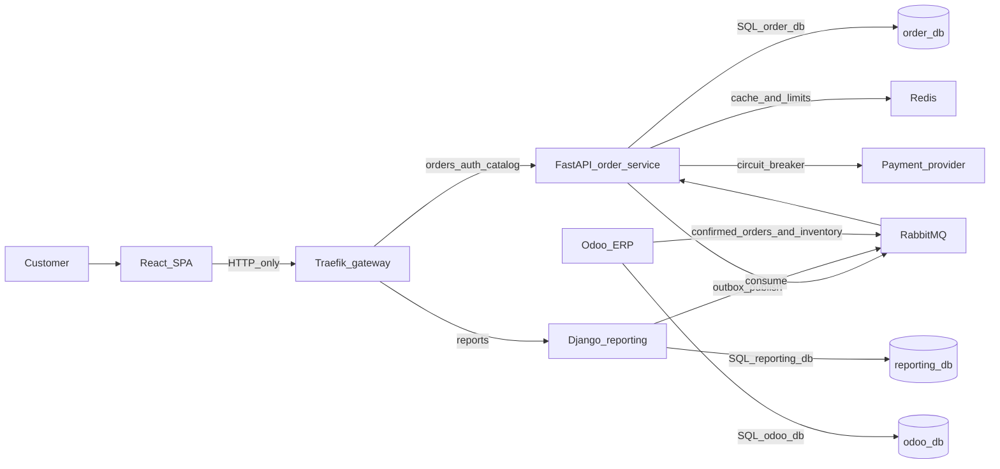

# Commerce platform (learning project)

This repository is a learning project for a small commerce platform. It is designed with the same boundaries a production system would need. Phase 0 fixed the vocabulary. Phase 1 is the FastAPI order service in `services/order-service`: the domain, `order_db`, and the HTTP API. Phase 2 adds authentication and authorization on that service. Phase 3 is the React storefront in `services/frontend`. It calls the order service over HTTP. Phase 4 publishes the domain events those aggregates already record to RabbitMQ after the database commit. Phase 5 makes the order service's inventory consumer idempotent and routes failed deliveries through retry queues into a dead-letter queue. The outbox publisher, Django, Odoo, the gateway, and Kubernetes are not built yet.

Nothing here is production-ready. The order service can run against local Postgres and RabbitMQ containers. The storefront is a Vite dev server. The rest of the platform does not run.

## Learning goal

Build one system in which a customer can browse products and place an order, while three backends keep separate databases and stay aligned through events:

- The **order service** (FastAPI) is the only writer of order state.
- The **reporting service** (Django) builds read models for analytics.
- **Odoo** handles ERP work (sales, inventory, delivery, invoicing) and only learns about orders after they are confirmed.

You will practice why those boundaries exist, how they fail, and how to notice the failure. Later phases add code. This phase fixes the vocabulary so those phases do not invent a second design.

## Architecture snapshot



The browser talks only to HTTP APIs through the gateway. It never opens Postgres, RabbitMQ, Redis, or Odoo. Strong consistency stops at a single service database. Everywhere else, consistency is eventual.

Read the picture in detail in [docs/architecture.md](docs/architecture.md).

## How to read the docs

Read in this order. Later files assume the earlier decisions.

| Order | Document | What you should understand when you finish it |
| --- | --- | --- |
| 1 | [docs/architecture.md](docs/architecture.md) | Context, containers, state machine, communication, failure isolation |
| 2 | [docs/services.md](docs/services.md) | What each component owns, and what it must refuse to do |
| 3 | [docs/database.md](docs/database.md) | Which database is authoritative, and what a transaction may include |
| 4 | [docs/events.md](docs/events.md) | The event envelope and every event in the catalog |
| 5 | [docs/outbox.md](docs/outbox.md) | Why the order row and the message are written together |
| 6 | [docs/rabbitmq.md](docs/rabbitmq.md) | Exchanges, queues, retries, dead letters |
| 7 | [docs/idempotency.md](docs/idempotency.md) | Why consumers and POST endpoints must tolerate duplicates |
| 8 | [docs/api.md](docs/api.md) | The HTTP surface later phases will implement |
| 9 | [docs/security.md](docs/security.md) | JWT, roles, and what the gateway is allowed to trust |
| 10 | [docs/adr/](docs/adr/) | Why this stack was chosen, including the alternatives that lost |

Use the remaining docs when you reach the phase that implements them. They are design stubs: the decision is recorded, the software is not built.

- [docs/docker.md](docs/docker.md) — Compose first
- [docs/kubernetes.md](docs/kubernetes.md) — kind later
- [docs/observability.md](docs/observability.md), [docs/prometheus.md](docs/prometheus.md), [docs/grafana.md](docs/grafana.md), [docs/alerting.md](docs/alerting.md) — how we see failure
- [docs/testing.md](docs/testing.md) — what is worth testing before the cluster exists
- [docs/failure-scenarios.md](docs/failure-scenarios.md) — expected behavior when a dependency dies
- [docs/disaster-recovery.md](docs/disaster-recovery.md) — what must be restorable
- [docs/deployment.md](docs/deployment.md) — how a later phase should ship this

Most design docs are still marked **Phase 0 design; not implemented**. [docs/security.md](docs/security.md) and [docs/api.md](docs/api.md) note what Phase 2 implemented. [docs/rabbitmq.md](docs/rabbitmq.md) is the topology Phase 4 declares and Phase 5 uses for retries. The transactional outbox in that document is still Phase 6.

## Technology decisions (short)

| Concern | Choice |
| --- | --- |
| Storefront | React + TypeScript |
| Edge | Traefik |
| Orders and catalog writes | FastAPI, Clean Architecture; MVC only in HTTP adapters |
| Reporting | Django, own database, CQRS read model |
| ERP | Odoo, own database |
| Databases | PostgreSQL: `order_db`, `reporting_db`, `odoo_db` |
| Broker | RabbitMQ, topology `commerce-platform-topology` |
| Cache and shared rate limits | Redis, never the source of truth |
| Local runtime | Docker Compose, then kind |
| Metrics / dashboards / alerts / traces | Prometheus, Grafana, Alertmanager, OpenTelemetry |

The full table, including what we refused to add, is in [docs/architecture.md](docs/architecture.md). Trade-offs are in the ADRs.

## Phase plan

Phases 0 through 3 are done. Later phases are not started. This checklist is the authoritative order from the project specification. Some design notes still mention an earlier draft numbering (Compose-only as phase 1, observability as phase 17, kind as phase 18). When a sentence and this list disagree, follow this list. Kubernetes does not start before the system runs under Docker Compose.

- [x] **Phase 0 — Architecture.** Boundaries, events, state machine, communication matrix, ADRs. No application code.
- [x] **Phase 1 — FastAPI foundation.** Clean Architecture, MVC at the HTTP edge, PostgreSQL, SQLAlchemy, Alembic, domain model, order state machine, basic REST APIs, unit tests. See [How to run Phase 1](#how-to-run-phase-1).
- [x] **Phase 2 — Authentication.** Registration, login, JWT access and refresh, roles, authorization. See [How to run Phase 2](#how-to-run-phase-2).
- [x] **Phase 3 — React.** Login, products, cart, checkout, orders, order history. HTTP only. See [How to run Phase 3](#how-to-run-phase-3).
- [x] **Phase 4 — RabbitMQ.** Exchanges, queues, producers, consumers, routing keys, acknowledgements. See [How to run Phase 4](#how-to-run-phase-4).
- [x] **Phase 5 — Reliability.** Idempotency, retry, backoff, dead-letter queue, timeouts. See [How to run Phase 5](#how-to-run-phase-5).
- [ ] **Phase 6 — Outbox.** Order and outbox event in one transaction, then the publisher.
- [ ] **Phase 7 — Django reporting.** Reporting database, consumers, read models, reports.
- [ ] **Phase 8 — Odoo.** Confirmed-order integration, customers, products, inventory sync, failures.
- [ ] **Phase 9 — Redis.** Product cache, rate limiting, optional idempotency support.
- [ ] **Phase 10 — API gateway.** Traefik: routing, CORS, request IDs, authentication enforcement, rate limiting.
- [ ] **Phase 11 — Docker Compose.** The full local stack, after the applications already work.
- [ ] **Phase 12 — Observability.** Structured logs, Prometheus, Grafana, Alertmanager, OpenTelemetry.
- [ ] **Phase 13 — Kubernetes.** kind, after Compose. Namespace, deployments, services, ConfigMaps, Secrets, PVCs, Ingress, probes.
- [ ] **Phase 14 — Scaling.** FastAPI replicas, competing consumers, HPA, queue-backlog monitoring.
- [ ] **Phase 15 — CronJobs.** Retention, batched cleanup.
- [ ] **Phase 16 — CI/CD.** Lint, tests, security scans, image build and scan.
- [ ] **Phase 17 — Load testing.** Product browse, order create, order read.
- [ ] **Phase 18 — Failure lab.** Break RabbitMQ, PostgreSQL, Redis, Django, Odoo, and FastAPI pods on purpose.
- [ ] **Phase 19 — Disaster recovery.** Backup, restore, persistent volume recovery. RTO and RPO.
- [ ] **Phase 20 — Architecture review.** What would still have to change for a real production system.

## How to run Phase 1

From `services/order-service`:

```bash
python3 -m venv .venv
. .venv/bin/activate
pip install -e ".[dev]"
docker compose up -d
alembic upgrade head
uvicorn order_service.presentation.app:app --app-dir src --port 8000
```

Open `http://127.0.0.1:8000/docs` for the generated OpenAPI document. `GET /health/live` answers even when Postgres is down. `GET /health/ready` answers only when `order_db` accepts a query.

```bash
pytest
```

Unit and API tests use an in-memory unit of work. The Postgres tests in `tests/integration` run when the Compose database is up and skip when it is not.

The database password in `compose.yaml` is a local placeholder bound to `127.0.0.1`. It is not a credential for any shared environment.

## How to run Phase 2

Start the service the same way as Phase 1 (`alembic upgrade head` applies the accounts revision). Then create a local RS256 key pair outside git. `*.pem` is gitignored.

```bash
openssl genpkey -algorithm RSA -pkeyopt rsa_keygen_bits:2048 -out jwt_private.pem
openssl rsa -in jwt_private.pem -pubout -out jwt_public.pem
```

Point the process at those files (or paste the PEM text into `JWT_PRIVATE_KEY_PEM` and `JWT_PUBLIC_KEY_PEM`). Names are listed empty in `.env.example`.

```bash
export JWT_PRIVATE_KEY_PATH=jwt_private.pem
export JWT_PUBLIC_KEY_PATH=jwt_public.pem
export INTERNAL_SERVICE_TOKEN=local-dev-only
uvicorn order_service.presentation.app:app --app-dir src --port 8000
```

Register a customer. The server sets the role to `customer`. A `role` field in the body is ignored.

```bash
curl -s -X POST http://127.0.0.1:8000/api/v1/auth/register \
  -H 'content-type: application/json' \
  -d '{"email":"ada@example.com","display_name":"Ada","password":"choose-a-password"}'
```

Send the access token on later calls: `Authorization: Bearer <access_token>`. Refresh with `POST /api/v1/auth/refresh` and the refresh token in the JSON body. Logout with `POST /api/v1/auth/logout` revokes that refresh token.

Staff are not created by register. From `services/order-service`, with the database migrated:

```bash
SEED_ADMIN_EMAIL=admin@example.com SEED_ADMIN_PASSWORD='choose-a-password' \
  python -m order_service.infrastructure.seed_staff
```

`SEED_MANAGER_EMAIL` and `SEED_MANAGER_PASSWORD` follow the same rule. If the email already exists, the seed skips it. The password is not printed.

`POST /api/v1/orders` takes the customer from the access token. Internal fulfillment (`/api/v1/internal/orders/...`) needs `X-Internal-Token` equal to `INTERNAL_SERVICE_TOKEN`. If that variable is empty, those routes return 503.

## How to run Phase 3

Two processes. The storefront does not open Postgres, RabbitMQ, Redis, or Odoo. Start the order service the same way as [Phase 2](#how-to-run-phase-2), including the JWT key pair and `alembic upgrade head`. Then, in another terminal, from `services/frontend`:

```bash
npm install
npm run dev
```

Open `http://127.0.0.1:5173`. `VITE_API_BASE_URL` defaults to `http://127.0.0.1:8000` (see `services/frontend/.env.example`). Register a customer in the browser, or sign in with an account you already created.

The browser calls the order service directly. That is a shortcut until Phase 10, when Traefik is the only public front door. It is not a second architecture: the same `/api/v1` routes, the same tokens, and the same rule that the client does not choose prices, totals, `customer_id`, or roles.

Vite (`http://127.0.0.1:5173` and `http://localhost:5173`) is a different origin from the API, so the order service allows those two origins in CORS middleware. That middleware is temporary. Traefik replaces it in Phase 10. The allowlist is not `*`. A matching `Origin` does not skip authentication.

The access token stays in memory. The refresh token is also written to `sessionStorage` so a reload of this tab can call `POST /api/v1/auth/refresh`. Production would use an httpOnly cookie set by the server. `sessionStorage` is readable by any script on the page, which is the same exposure as `localStorage`.

There is no cart API. The cart lives in React state and `sessionStorage`. Checkout sends `POST /api/v1/orders` with product ids and quantities. The server prices the lines and stores the order. The number on the cart page is an estimate.

`POST /api/v1/products` is admin-only. The new-product form is shown only when the access token payload says `admin`. The browser does not verify the signature; the API does. Seed an admin with the Phase 2 command if you want that form. Customers can browse, check out, confirm, cancel a pending order, and read their own history.

```bash
cd services/frontend
npm test
npm run build
```

## How to run Phase 4

RabbitMQ is the second service in `services/order-service/compose.yaml`. This is still not the full platform Compose file. From `services/order-service`, with the virtualenv from Phase 1:

```bash
docker compose up -d
pip install -e ".[dev]"
```

AMQP is published on `127.0.0.1:5672` only. The management UI is [http://127.0.0.1:15672](http://127.0.0.1:15672) (user `order_service`, password `order_service`). Those values are local placeholders, the same kind as the Postgres password in that file. They are not credentials for a shared environment.

Start the API the same way as [Phase 2](#how-to-run-phase-2). After `order_db` commits, the process publishes the aggregate's domain events to the topic exchange `commerce.events`. The routing keys in use are:

| Event | Routing key |
| --- | --- |
| `OrderCreated` | `order.created` |
| `OrderConfirmed` | `order.confirmed` |
| `OrderCancelled` | `order.cancelled` |
| `OrderProcessingStarted` | `order.processing-started` |
| `OrderShipped` | `order.shipped` |
| `OrderDelivered` | `order.delivered` |
| `ProductCreated` | `product.created` |
| `ProductUpdated` | `product.updated` |
| `CustomerUpdated` | `customer.updated` |

The producer names the exchange and the routing key. It does not name a queue. Queues belong to consumers. `q.reporting.projection` is bound to `order.*`, `product.*`, `customer.*`, and `payment.*` on `commerce.events` (and to `inventory.updated` on `erp.events`). `q.odoo.order-confirmed` is bound only to `order.confirmed`, so a pending order never lands there. Adding another consumer is a new binding, not a new release of the order service.

A publisher confirm is the broker's ack that it accepted the publish onto the exchange. It is not a consumer ack. The consumer acks only after its handler returns. Until that ack, the broker can redeliver the message. Phase 4 runs one consumer. Prefetch is 10, the starting value in [docs/rabbitmq.md](docs/rabbitmq.md), so that process is not handed an unbounded number of unacked messages.

Create an order through the API or the storefront. The event is on `q.reporting.projection` until something acks it. An `OrderCreated` message does not appear on `q.odoo.order-confirmed`. Payloads are not logged, because `CustomerUpdated` contains an email.

Phase 4 stopped at a nack with `requeue` false, which dropped the message. Phase 5 does not do that. The checked-in consumer listens on `q.order.inventory`. See [How to run Phase 5](#how-to-run-phase-5). Order events still arrive on `q.reporting.projection` and wait there until a reporting worker exists.

Connect, declare, and the publisher confirm each stop after `RABBITMQ_TIMEOUT_SECONDS` (default 5). A dead broker cannot hold the request open.

### This is not the outbox

Publish runs on the request, after the commit. If the process dies between the commit and the broker confirm, or RabbitMQ rejects the publish, the HTTP response is still the order that was committed. The event was not stored anywhere else. It can be lost. Confirming again does not emit it again: the state machine returns 409. Checkout also waits for that one publish attempt. Phase 6 writes the envelope into an outbox table in the same transaction as the order and moves publishing to a process that retries. A green HTTP response is not proof that reporting or Odoo will hear about the order.

```bash
pytest
ruff check
```

The RabbitMQ integration test skips when the broker is not reachable, so `pytest` stays green without Docker.

## How to run Phase 5

Start Postgres and RabbitMQ the same way as [Phase 4](#how-to-run-phase-4), then apply the new revision. From `services/order-service`:

```bash
alembic upgrade head
python -m order_service.infrastructure.messaging.consumer
```

That process is the order-service inventory worker. It consumes `q.order.inventory`, which is bound to `inventory.updated` on `erp.events`. It does not own `q.reporting.projection`. That queue is for the reporting service. One consumer, prefetch 10. Connect, declare, publisher confirms, the consumer's idle wait, and database calls on this path all stop at a timeout (`RABBITMQ_TIMEOUT_SECONDS`, default 5; `DB_CONNECT_TIMEOUT_SECONDS` and `DB_STATEMENT_TIMEOUT_MS` for Postgres). Shutdown stops new deliveries, finishes the one already in the callback, then closes the channel and the connection.

### Main queue, retry, dead letter

A handler failure is not put back on the same queue. `requeue=true` would deliver a poison message again immediately, fill the prefetch window with that message, and burn CPU until someone deletes the queue. The worker also does not `nack` with `requeue=false` on the main queue: those queues have no dead-letter argument, so that nack drops the message, and a nack cannot attach the attempt number.

What happens instead:

1. The worker publishes the same body to the exchange `commerce.retry` with routing key `order.inventory.retry.{attempt}` and header `x-retry-count`, and waits for a broker confirm.
2. It then acks the original delivery.
3. The retry queue holds the message for that attempt's TTL, then dead-letters it to `erp.events`. `q.order.inventory` is bound to those retry keys, so the message comes back to the main queue.
4. After five delayed retries the next failure is published to `commerce.dlx` with routing key `order.inventory`, which lands on `q.order.inventory.dlq`. Nothing consumes a dead-letter queue.

Backoff, from [docs/rabbitmq.md](docs/rabbitmq.md):

| Failure | Where it goes | Delay |
| --- | --- | --- |
| 1 | `q.order.inventory.retry.1` | 5 seconds |
| 2 | `q.order.inventory.retry.2` | 30 seconds |
| 3 | `q.order.inventory.retry.3` | 2 minutes |
| 4 | `q.order.inventory.retry.4` | 10 minutes |
| 5 | `q.order.inventory.retry.5` | 30 minutes |
| 6 | `q.order.inventory.dlq` | no further automatic retry |

The same ladder exists for `q.reporting.projection` and `q.odoo.order-confirmed`. This process only runs the inventory one.

**Transient** failures take that ladder: the handler returns a transient outcome, or it raises (a database timeout, a connection reset). **Permanent** failures go to the dead-letter queue on the first attempt. Retrying them cannot succeed. Those are a body that is not a JSON object, an `event_id` or `aggregate_id` that is not a UUID, a schema `version` other than 1, an event type this consumer does not handle (`InventoryUpdated` only), and an `InventoryUpdated` payload that breaks the schema (missing fields, a non-integer quantity, a non-positive `aggregate_version`). An older snapshot is not a failure. It is acked and ignored.

### Why event_id is stored

Delivery is at least once. The broker can redeliver after the consumer has committed and before it has acked, and a publisher can send the same `event_id` more than once. RabbitMQ does not dedupe. The inventory worker inserts `event_id` into `order_db.processed_events` (`event_id` primary key, `event_type`, `aggregate_id`, `processed_at`, `consumer_name`) in the same transaction as the `inventory_snapshots` write, then acks. A duplicate insert conflicts, the transaction commits nothing else, and the delivery is acked. The snapshot is not applied twice. A crash before commit leaves no row, so the redelivery tries again.

`inventory_snapshots` stores the last snapshot per product. The row changes only when `aggregate_version` is newer than `source_version`. Odoo is still the stock authority. This service does not write `reporting_db` or `odoo_db`.

If the AMQP `message_id` or `type` property disagrees with the JSON body, the body wins.

### This is still not the outbox

Publish still runs on the request, after the commit. If the process dies between the commit and the broker confirm, or RabbitMQ rejects the publish, the HTTP response is still the order that was committed. The event was not stored anywhere else. It can be lost. Phase 6 writes the envelope into an outbox table in the same transaction as the order and moves publishing to a process that retries. Reliability on the consumer does not close that hole. A green HTTP response is not proof that this inventory worker, reporting, or Odoo will hear about the order.

```bash
pytest
ruff check
```

The RabbitMQ retry test skips when the broker or Postgres is down. It waits through the 5-second and 30-second backoff, so a full run with Docker takes about a minute longer. `pytest` stays green without Docker.

## What Phase 1 deliberately leaves out

Phase 1 had no JWT. Phase 2 added it. Phase 3 adds the React storefront. Phase 4 publishes domain events after commit. Phase 5 retries and dedupes consumption. Still no gateway, no outbox table, no Redis, no Django, no Odoo, and no cluster. `saga_status` stays null. Phase 6 inserts the same events into the outbox in the same transaction as the row.

## What Phase 2 deliberately leaves out

No Redis rate limits, no idempotency keys, and no outbox. Access tokens are not denylisted; logout revokes the refresh token only. Refresh-token family revocation after theft, key storage in a KMS, and gateway verification are later work. The internal fulfillment check is a shared header, not mTLS.

## What Phase 3 deliberately leaves out

No gateway, so no Traefik routing, rate limit, or public CORS policy. The temporary allowlist on the order service is only for the Vite dev server. No RabbitMQ, outbox, Redis, Django, Odoo, Compose for the full stack, or Kubernetes. `saga_status` is still null; the order page renders it when the API sends a non-null value. `docs/api.md` lists `Idempotency-Key` on order writes. The service does not enforce that header yet, so the storefront does not send one.

## What Phase 4 deliberately leaves out

Phase 4 had no idempotency store, no retry loop, and no dead-letter path. A handler that raised was nacked without requeue, and the message was dropped. Phase 5 routes that failure through the retry queues. No outbox table and no outbox publisher: publish-after-commit can lose an event, and Phase 6 closes that hole. No Django projection and no Odoo client. No Redis, Traefik, Kubernetes, or the full platform Compose file. One consumer, prefetch 10. Competing consumers are a later phase. `PaymentConfirmed` and `PaymentFailed` are in the catalog and on the bindings. This service does not emit them. `saga_status` stays null.

## What Phase 5 deliberately leaves out

No outbox table and no outbox publisher. A broker outage after the order commit can still lose the first publish. Phase 6 closes that hole. No Django projection, so `q.reporting.projection` is declared and bound but this process does not apply those events. No Odoo client and no stock authority in this service: `inventory_snapshots` is a copy of `InventoryUpdated`, applied only when the version is newer. No HTTP idempotency keys, no Redis, no gateway, and no Kubernetes. Nothing consumes a dead-letter queue; a person replays or discards those messages later. `saga_status` stays null.
