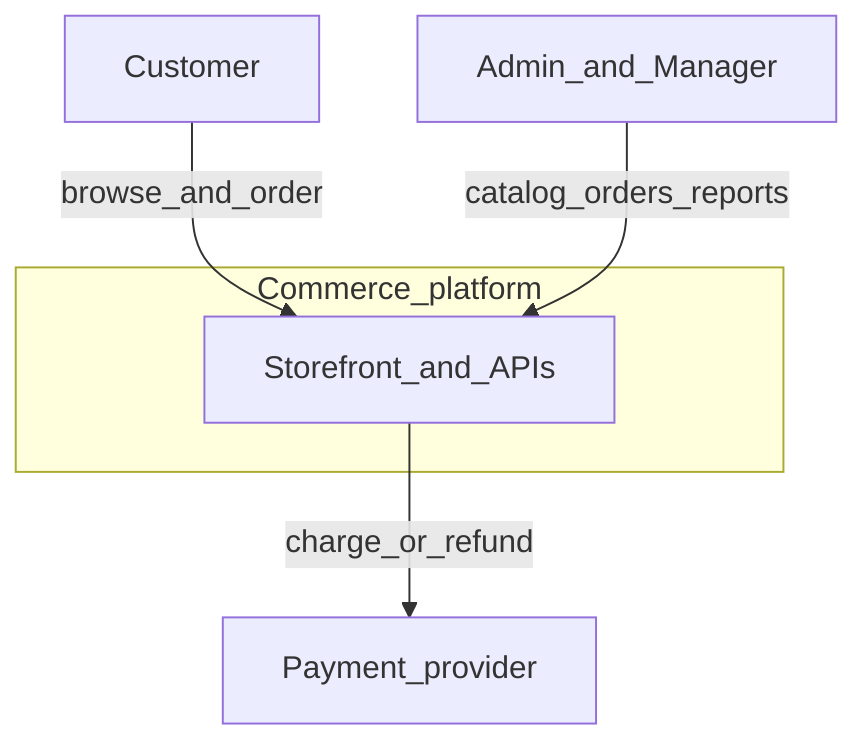
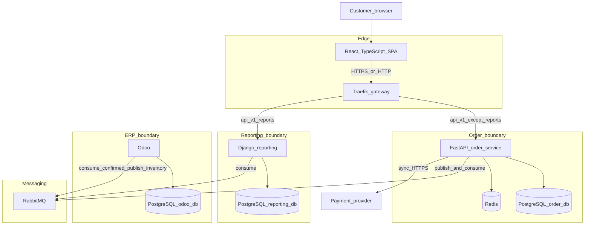
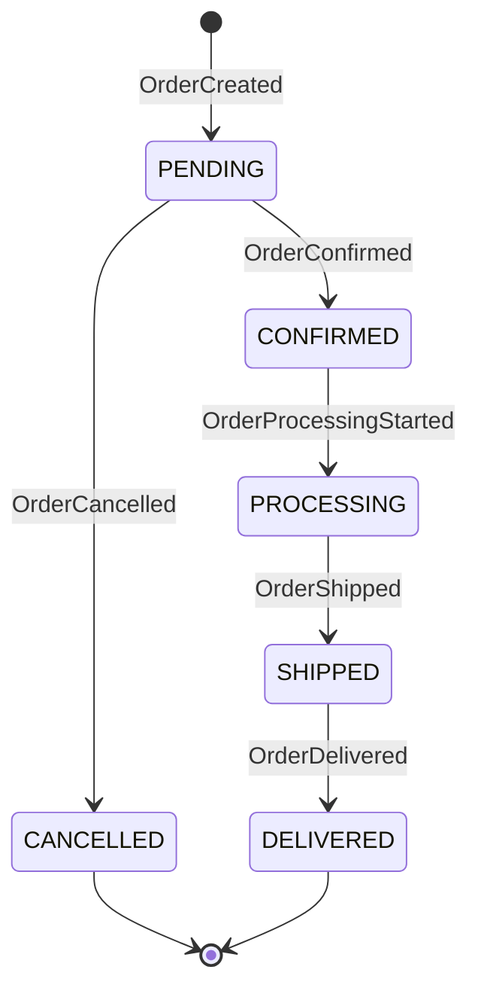
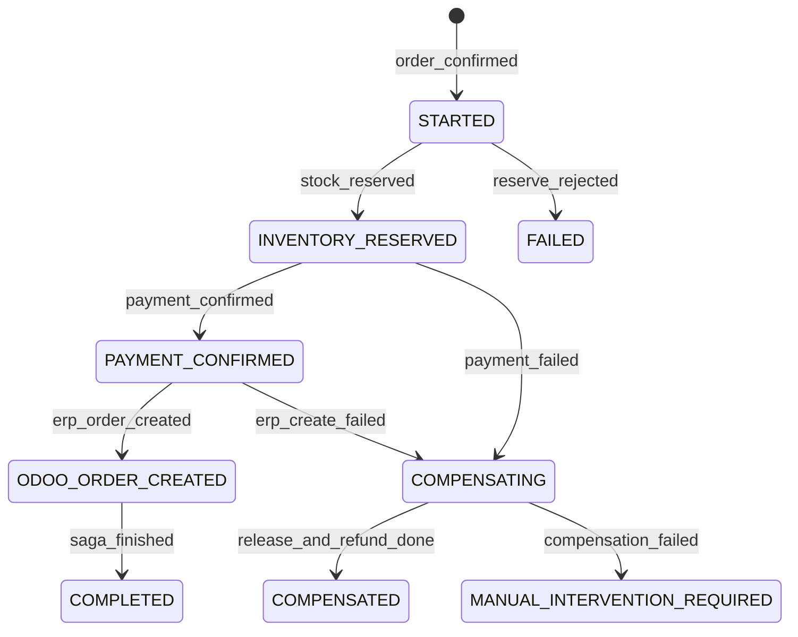
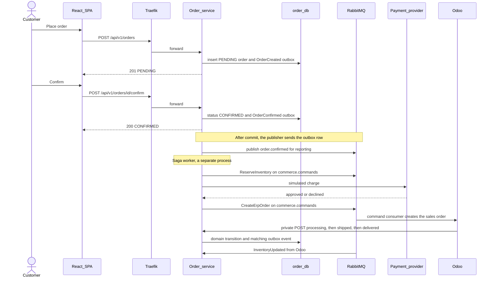
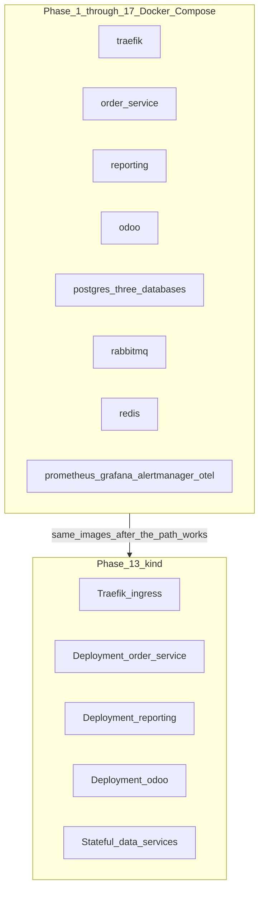
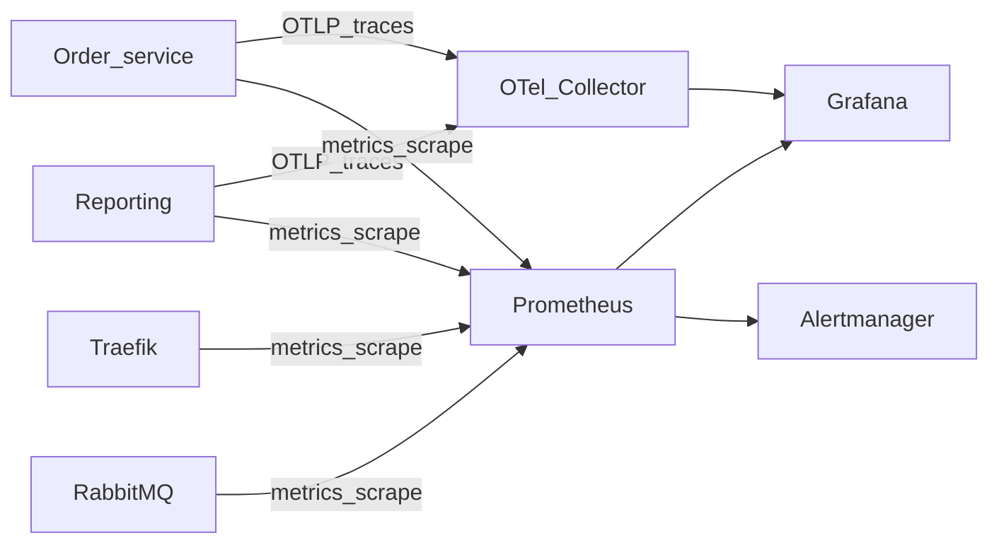

# Architecture

**Status: Phases 0–19 built this map in the repository. It is a learning system on one laptop. It is not production-ready. The gaps are in [architecture-review.md](architecture-review.md).**

This document is the map for every later phase. It names the system, the containers, the only legal order transitions, which conversations are HTTP, and which failures are allowed to spread.

The platform is a learning project shaped like a production commerce system. It is not in production, and this document does not claim a deployed environment.

## Purpose

A customer browses products and creates an order in a React application. Three backends then do different jobs:

- **Order service** accepts the order, stores it, and is the only component allowed to change order status.
- **Reporting service** answers questions about history and operations from its own copy of the facts.
- **Odoo** runs ERP: warehouse stock, the sales order, delivery, and invoicing. It receives an order only after confirmation.

They do not share tables. They meet at an HTTP gateway and at RabbitMQ.

## System context

People and external systems sit outside the platform. The platform is everything we build and operate for this project.

The payment provider is not one of our services. We call it because a saga step needs an immediate yes or no. That call is the only place a circuit breaker belongs. Warehouse staff can also use Odoo's own UI later; that UI is Odoo's, and it is not a second storefront.

Without this context boundary, learners tend to "just query Odoo from React" or "let the payment provider write the order row." Both moves hide a second writer inside another team's system. When that system is slow or wrong, checkout is slow or wrong, and there is no local transaction to roll back to.

## Containers

C4-style container view. Each box is a deployable unit or a data store. Arrows are allowed dependencies.

There is no auth service, inventory service, payment service, or saga service. Adding one would create a new database and a new failure domain this project has not justified. Authentication lives in the order service because that service already owns the customer account. The saga lives in the order service because the order aggregate is the business object the saga is about. Inventory truth lives in Odoo because stock, delivery, and invoicing must agree inside one ERP database.

### What crosses the wire

| From | To | Channel | Why this channel |
| --- | --- | --- | --- |
| React | Traefik | HTTP | Browsers already speak HTTP. The UI needs a status code and a body now. |
| Traefik | Order service | HTTP | The gateway only routes. It does not implement checkout. |
| Traefik | Reporting | HTTP | A report is a query. The user is waiting. |
| Order service | `order_db` | SQL in one transaction | Order, lines, and outbox row succeed or fail together. |
| Order service | RabbitMQ | AMQP publish to `commerce.events` | Other services must hear facts without joining the checkout transaction. |
| Order service | Redis | Redis protocol | Cache and shared counters. Loss of Redis must not lose an order. |
| Order service | Payment provider | Synchronous HTTPS | The saga needs the provider's answer before it continues. |
| Reporting | `reporting_db` | SQL | Projections and report queries. Never `order_db`. |
| Reporting | RabbitMQ | AMQP consume | This is how the read model is built. |
| Odoo | `odoo_db` | SQL | ERP documents are Odoo's. |
| Odoo | RabbitMQ | AMQP consume `order.confirmed`; publish `inventory.updated` | Confirmed orders arrive even if Odoo was down at checkout. Stock changes leave Odoo the same way. |
| Odoo module | Order service internal HTTP | HTTP on a private route | Fulfillment milestones (`processing`, `shipped`, `delivered`) are commands to the only writer of order state. A rejected transition comes back as an HTTP error the module can retry. |
| Anyone | Another service's database | Not allowed | A shared table is a shared outage and a shared schema calendar. |

The private fulfillment routes are not on the public browser API. Traefik does not expose them to the internet. See [api.md](api.md) and [security.md](security.md).

### Why the gateway exists

React would otherwise need the address of every service, and every service would reimplement CORS, request IDs, and a coarse rate limit. The gateway is a single front door:

- Route `/api/v1/reports/` to Django and the rest of `/api/v1/` to FastAPI.
- Reject missing or invalid JWTs before the request hits a worker that would do real work.
- Add a correlation ID when the caller did not send one.
- Apply CORS for the storefront origin.
- Apply a coarse per-IP rate limit.

The gateway contains no business rules. It does not decide whether an order may move from `PENDING` to `CONFIRMED`. If it did, we would have two policy engines, and they would drift.

Traefik is the chosen gateway. The comparison with nginx is [ADR-012](adr/ADR-012-why-api-gateway.md).

## Order state machine

These are the only transitions. The domain model rejects anything else. Controllers translate the domain error into HTTP 409. They do not contain a second copy of the rules.

| From | To | Who may ask | What becomes true |
| --- | --- | --- | --- |
| — | `PENDING` | Customer creating an order | The order and its lines exist. Odoo has not been told. |
| `PENDING` | `CONFIRMED` | Owning customer, or Admin/Manager on that customer's behalf | The saga may start. The outbox carries `OrderConfirmed`. |
| `PENDING` | `CANCELLED` | Owning customer, or Admin/Manager | The order is terminal. Odoo never received it, so there is nothing to cancel in ERP. |
| `CONFIRMED` | `PROCESSING` | Odoo integration, after the ERP order exists and the warehouse has started | Fulfillment has started. Automatic saga compensation no longer applies. |
| `PROCESSING` | `SHIPPED` | Odoo integration when the delivery leaves | A carrier reference may be stored. |
| `SHIPPED` | `DELIVERED` | Odoo integration when delivery is confirmed | The order is terminal. |

There is no `CONFIRMED -> CANCELLED` edge. A payment failure after confirmation does not cancel the order. The order stays `CONFIRMED`, and a separate saga status records that compensation ran. The API returns both fields so the UI does not tell the customer that a compensated order is a healthy confirmed order.

That split is deliberate. The state machine is small enough to test by hand. The saga has more states because external systems fail in ways the customer's order status should not imitate. Mixing them would either add illegal transitions or pretend that a refund is the same fact as "the customer cancelled before we started."

### Saga status (conceptual)

The saga is not a new service. Its row lives in `order_db`, in the same database as the order, so the order version and the saga step can commit together. Implementation is Extension Phase 1, described in [saga-pattern.md](saga-pattern.md). README Phase 15 is the retention CronJob. The state names below are the ones the code persists. An older draft used `INVENTORY_RESERVING`, `PAYMENT_PENDING`, `ERP_CREATING`, and `AWAITING_FULFILLMENT`, and it used `COMPLETED` to mean `DELIVERED`. That draft is not the implementation.

The API field `saga_status` uses these exact values. It is null before confirmation and after a cancel from `PENDING`. `COMPLETED` means reserve, simulated payment, and ERP create finished. It does not mean the parcel was delivered.

| `saga_status` | Meaning |
| --- | --- |
| `STARTED` | Confirm committed. Reserve has not succeeded |
| `INVENTORY_RESERVED` | Stock is reserved in Odoo |
| `PAYMENT_CONFIRMED` | The simulated charge succeeded. Order status is still `CONFIRMED` |
| `ODOO_ORDER_CREATED` | The ERP sales order exists |
| `COMPLETED` | Reserve, simulated payment, and ERP create finished |
| `COMPENSATING` | Release, simulated refund, or ERP cancel is in progress |
| `COMPENSATED` | Compensation finished. Order status is still `CONFIRMED` |
| `FAILED` | Reserve was rejected. Nothing was held |
| `MANUAL_INTERVENTION_REQUIRED` | A compensation step failed. This is not `COMPENSATED` |

Compensation releases a reservation, refunds a captured payment if one exists, and cancels an ERP sales order if one was created. It does not emit `OrderCancelled`, because that event means "cancelled while `PENDING`." Once the order is `PROCESSING`, this automatic compensation path is closed. Later warehouse problems are operational exceptions, handled by people, still without an illegal transition.

Sequence on the happy path:

The confirm HTTP call returns when the local transaction commits. It does not wait for Odoo or the payment provider. Anyone who reads "confirmed" as "paid and shipped" has skipped the saga status. The UI must use both.

## Consistency boundaries

| Inside this boundary | Guarantee |
| --- | --- |
| One transaction in `order_db` | Strong. The order row, its lines, and the outbox row match. |
| One transaction in `reporting_db` | Strong for that projection write and its processed-event row. The projection may still be behind the order service. |
| One transaction in `odoo_db` | Strong for Odoo documents and the connector's processed-event row. |
| Between services | Eventual. A reader can see a confirmed order in `order_db` before Django or Odoo has applied `OrderConfirmed`. |
| Redis versus `order_db` | Eventual, and Redis may be empty. Postgres wins. |
| `InventorySnapshot` versus Odoo stock | Eventual. The snapshot can be stale. Reservation in Odoo is the stock authority. |

What happens without the boundary: a distributed transaction (two-phase commit) across FastAPI, Django, and Odoo. One slow database then holds locks in the others. Checkout latency becomes the sum of every participant, and a failure in reporting can roll back a sale. We accept a delay on dashboards and on ERP instead.

What happens when it fails: a consumer is down or a message is duplicated. The outbox keeps the fact until publish succeeds. Consumers deduplicate. Detection and recovery are in [outbox.md](outbox.md), [rabbitmq.md](rabbitmq.md), and [idempotency.md](idempotency.md).

How it scales: each service scales on its own bottleneck. Reporting replicas do not need to write orders. Extra Odoo workers do not take locks on `orders`. The cost is that no query can join live order rows to live stock. Reports and the snapshot are copies.

> **Learning simplification.** One PostgreSQL server hosts three databases so a laptop can run Phase 1. That shares a fate: if the container stops, all three databases stop.
> **Production would require.** Separate instances (or separate managed databases with separate network paths) so a disk failure or a connection storm in reporting cannot exhaust the order database.

## Deployment sketch

Compose is the first runtime. kind is the second. The application behavior does not change between them; the packaging does.

Do not start kind before Compose. A wrong database URL is a one-line Compose log. The same bug inside Kubernetes is a CrashLoopBackOff, a probe failure, and an ingress timeout stacked on top of each other. Details: [docker.md](docker.md) and [kubernetes.md](kubernetes.md). Choice of kind: [ADR-008](adr/ADR-008-why-kubernetes.md).

## Observability architecture

We need to answer four questions when something looks wrong: which request, which hop, how often, and whether a human should act.

- **OpenTelemetry** propagates `traceparent` and exports traces. It is not the metrics database.
- **Prometheus** scrapes `/metrics` and infrastructure exporters. It is not a dashboard.
- **Grafana** is how humans read those series and traces. It is not the pager.
- **Alertmanager** routes alerts. Grafana is not a second paging system.

Correlation: Traefik accepts `X-Correlation-Id` when it is a UUID, otherwise it generates one, and forwards it. Services log it and copy it onto events. The W3C trace id may differ from the correlation id; both are kept. The correlation id is the business thread that ties a checkout click to `OrderConfirmed` and to the Odoo sales order. The trace id is the technical thread of spans.

Detection that matters later:

| Signal | Means |
| --- | --- |
| Outbox oldest pending age | Facts are committed and not leaving the service |
| Dead-letter depth greater than zero | A consumer gave up |
| Reporting lag versus order version | Dashboards are stale |
| Payment circuit state open | The provider is being failed fast |
| HTTP 5xx and latency at the gateway | Users are feeling the failure |
| Ready-probe failure | A dependency the process needs is gone |

> **Learning simplification.** One collector, one Prometheus, one Grafana, one Alertmanager, short retention, HTTP inside the Compose network.
> **Production would require.** TLS, remote long-term metrics storage, highly available Alertmanager, and a real on-call route. None of that is built here.

See [observability.md](observability.md), [prometheus.md](prometheus.md), [grafana.md](grafana.md), [alerting.md](alerting.md), and ADRs 009–011.

## Failure isolation

A failure should stop the capability that depends on the failed part, and leave the others readable.

| Failure | Checkout writes | Reports | ERP documents already stored | How we notice | How we recover |
| --- | --- | --- | --- | --- | --- |
| `order_db` down | Fail | Still served, stale | Still in Odoo | Order service readiness fails, 5xx on writes | Restore `order_db`, then run the publisher |
| Order service down | Fail | Still served | Odoo can keep shipping local work; milestone posts retry | Probe and gateway 502 | Restart the service; inbox and outbox resume |
| `reporting_db` or Django down | Succeed | Fail | Unaffected | Report 5xx, consumer lag | Restore the read model; replay from the queue or from a rebuild |
| Odoo down | Confirm still commits | Unaffected until stock events pause | Unavailable | Queue `q.odoo.order-confirmed` grows; snapshot age grows | Odoo returns; consumers drain; saga retries the ERP step |
| RabbitMQ down | Local commits succeed; publish pauses | Stops updating | Stops receiving new confirms | Outbox age, broker probe | Broker returns; publisher drains the outbox |
| Redis down | Orders still commit | Unaffected | Unaffected | Cache errors; auth rate limit fails closed | Reads hit Postgres; cache refills; limits work again |
| Payment adapter open | Create and confirm still commit; the saga records `PaymentFailed` and compensates | Sees `PaymentFailed` once recorded | No sales order if we have not created one | `payment_circuit_state` | Half-open trial; `COMPENSATED` if release succeeds, otherwise `MANUAL_INTERVENTION_REQUIRED` |
| Gateway down | No public traffic | No public traffic | Internal ERP UI may still work if exposed only on a private port | External probe | Restart Traefik; no data restore |

Without isolation, one shared database means the reporting backup, the Odoo module upgrade, and the order migration share a lock and a disk. A long report query can then stall checkout. The separate databases exist so that those jobs do not sit on the same tables.

The local single-server Postgres shortcut weakens this picture on a laptop. The application must still use three users and three databases, so the code cannot "temporarily" join across them. The shortcut is only the host process.

## Circuit breaker

One breaker, around the simulated payment adapter inside the order service. It is not a call to a payment provider.

Why only there: a charge that keeps failing should fail the saga step and let compensation run, instead of sitting on the worker. RabbitMQ already buffers Odoo and reporting. Putting a breaker on a consumer would hide messages we would rather retry. Putting a breaker on Postgres would turn a short database blip into a self-inflicted outage.

The adapter opens after a small run of consecutive declines, then allows one half-open trial. A successful trial closes it. A failed trial opens it again. While open, a charge returns `circuit_open`, the saga records `PaymentFailed` with that reason, and compensation runs. The gauge `payment_circuit_state` is 0 closed, 1 half-open, 2 open. The worker copies the adapter into that gauge. The API process leaves it at closed until a worker has set it.

If the simulated adapter stays open, orders sit at `CONFIRMED` with saga status `COMPENSATED` when release succeeded, or `MANUAL_INTERVENTION_REQUIRED` when a compensation step failed. No other integration gets this wrapper in this project.

## Technology decisions

| Concern | Decision | Not chosen for this project |
| --- | --- | --- |
| Storefront | React + TypeScript | Server-rendered pages, a mobile client |
| Gateway | Traefik | nginx as primary; a service mesh |
| Orders | FastAPI, Clean Architecture, MVC only at the HTTP edge | Django for writes; business rules in routers |
| Reporting | Django and `reporting_db` | Reading `order_db` for dashboards |
| ERP | Odoo and `odoo_db` | A hand-rolled inventory service |
| Broker | RabbitMQ, topology name `commerce-platform-topology` | Kafka for this volume and ops budget |
| Cache / limits | Redis, discardable | Redis as a system of record |
| App databases | PostgreSQL, database per service | One schema for all services |
| First runtime | Docker Compose | Installing kind first |
| Cluster | kind | minikube, k3d |
| Metrics | Prometheus | Logs as the only signal |
| Dashboards | Grafana | Alerting from the dashboard tool |
| Alerts | Alertmanager | A second alert path inside Grafana |
| Traces | OpenTelemetry | A vendor SDK with no export standard |
| Auth | JWT access + refresh, RS256, roles from the server | Client-supplied role headers |
| Payment | External HTTPS with one circuit breaker | A payment microservice we would have to operate |

ADRs: [001](adr/ADR-001-why-fastapi.md) through [012](adr/ADR-012-why-api-gateway.md).

## Scaling picture

| Component | How it grows | What breaks if you ignore the limit |
| --- | --- | --- |
| React | Static assets behind the gateway or a CDN | The API is not the place to scale HTML |
| Traefik | More replicas, with the limit that in-memory rate limits are per replica | A limit that worked on one node stops being a global limit |
| Order service | Phase 14: 2 API replicas behind the gateway, CPU HPA from 2 to 4. One outbox publisher until publishers are partitioned by aggregate | Two publishers without `SKIP LOCKED` can double-send or deadlock. Two publishers with `SKIP LOCKED` can still publish version 2 before version 1 |
| Reporting consumers | Phase 14: 2 competing consumers. Handlers version-gate and dedupe on `event_id` | Unordered applies corrupt totals |
| Odoo | Odoo's own workers. Our connector stays a module, not a new service | A separate connector service would be another database and another deploy |
| Postgres | Bigger instance per database, then read replicas for reporting only | A replica of `order_db` used for checkout writes splits the brain |
| RabbitMQ | Quorum queues when we leave the laptop | A single broker disk is a single point of failure |
| Redis | One primary is enough while it is a cache | Promoting Redis to source of truth makes eviction a data-loss bug |

> **Learning simplification.** Phase 14 runs two API replicas, a CPU HPA, two competing consumers, one publisher, one broker node, classic queues, prefetch 10.
> **Production would require.** Quorum queues, a defined publisher partition scheme, per-database capacity tests, and a CDN for the SPA.

## Related documents

- [services.md](services.md) — responsibilities and refusals
- [database.md](database.md) — ownership and migrations
- [events.md](events.md) — catalog
- [failure-scenarios.md](failure-scenarios.md) — drills for Phase 19
