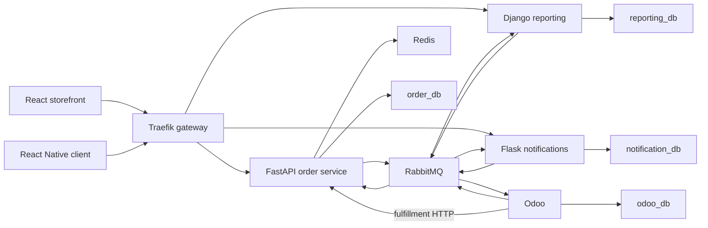

# Current architecture

**Status: Extension Phase 5, plus the React Native client from Extension Phase 6, plus the structure and startup pages from Extension Phase 7, plus the HTML explorer from Extension Phase 8, plus the operational tests from Extension Phase 9, plus the cross-links from Extension Phase 10.** This page describes what is in the tree today. The bilingual learning portal for this picture is [system-architecture.html](system-architecture.html). How to open it, switch language, and use the map and workflows is [learning-portal.md](learning-portal.md). The gap between this picture and the extension is [docs/extension-gap-analysis.md](extension-gap-analysis.md). Product cache-aside, the 30 second TTL, and the cache series are [docs/caching-strategy.md](caching-strategy.md). The mobile client is [mobile/react-native-app/README.md](../mobile/react-native-app/README.md). The directory listing is [project-structure.md](project-structure.md). Local dependencies, full Compose, and kind are [run-the-project.md](run-the-project.md).

This page was written by reading the tree. Pytest, Docker Compose, and kind were not run for it. Live Compose, kind, Locust, and restore were not executed on this machine. That limit is already stated in [docs/testing.md](testing.md) and [docs/architecture-review.md](architecture-review.md). Extension Phase 9 extended the existing suites; the commands and results are in [docs/testing.md](testing.md). That page does not record requests per second, latency, or a split across replicas. No timing, queue depth, or request-distribution number is invented here.

The storefront is the React application in `services/frontend`. Extension Phase 6 added the React Native client at `mobile/react-native-app`. It uses the gateway HTTP API. It was not launched on a device or emulator, and it does not include FCM. Extension Phase 3 added the Flask notification service at `services/notification-service`, with database `notification_db`. That service is [docs/flask-notification-service.md](flask-notification-service.md).

## Services

The order, reporting, Odoo, and notification codebases, the browser storefront, the React Native client, and a gateway that is not another business service.

| Piece | Path | Role |
| --- | --- | --- |
| Order service | `services/order-service` | FastAPI. Clean Architecture: the state machine is in the domain, use cases commit one `order_db` transaction, HTTP is an adapter. Owns accounts, the catalog, and orders. |
| Reporting service | `services/reporting-service` | Django. Read models in `reporting_db`. A separate consumer applies the broker stream. |
| Odoo | `services/odoo` | Odoo 18 Community (`FROM odoo:18.0` in `services/odoo/Dockerfile`). Module `commerce_connector` creates one sales order from `CreateErpOrder` and writes inventory facts into `odoo_db`. `OrderConfirmed` is recorded and does not create a second sales order. |
| Storefront | `services/frontend` | React 19 and Vite (`services/frontend/package.json`). Browser routes: login, register, products, cart, checkout, orders (`services/frontend/src/App.tsx`). |
| Mobile client | `mobile/react-native-app` | React Native Community CLI and TypeScript. Sign in, register, products, cart, checkout, orders, and device tokens. Commands from this machine are in that directory's README. |
| Notification service | `services/notification-service` | Flask. `notification_db`, mock email and push, device tokens, consumer on `q.notification.delivery`. |
| Gateway | `deploy/gateway` | Traefik. Routing, CORS, request IDs, JWT forward-auth, and a coarse in-memory rate limit. Not a business service and not a database owner. |

Compose runs one container of each of those processes, plus workers that are the same images with different commands: `order-outbox-publisher`, `order-inventory-consumer`, `reporting-consumer`, `notification-consumer`, `odoo-consumer`, and `odoo-publisher` (`deploy/compose/docker-compose.yml`). The React Native client is not a Compose service.

The order state machine is `PENDING` → `CONFIRMED` → `PROCESSING` → `SHIPPED` → `DELIVERED`. Cancel is legal only from `PENDING` (`services/order-service/src/order_service/domain/entities/order_status.py`). Confirm sets `orders.saga_status` to `STARTED`. Later saga steps mirror the `saga_instances` row. `COMPLETED` means reserve, simulated payment, and ERP create finished. See [saga-pattern.md](saga-pattern.md).

## Databases

Four Postgres databases, four owners. A transaction does not open more than one of them. Compose runs them as four servers (`postgres`, `reporting-postgres`, `notification-postgres`, `odoo-db` in `deploy/compose/docker-compose.yml`). [docs/database.md](database.md) still has an older note that a laptop might put the original three in one container. The Compose file does not do that. `notification_db` is a fourth server, added in Extension Phase 3.

### `order_db` (order service, Alembic)

Tables mapped in `services/order-service/src/order_service/infrastructure/database/models.py`:

| Table | Role |
| --- | --- |
| `accounts` | Email, password hash, role |
| `customers` | Customer profile. Same id as the account |
| `products` | Catalog. Price is minor units and a currency code |
| `orders` | Status, customer, total, version, `saga_status` (mirrors `saga_instances`), tracking reference, cancel reason |
| `order_items` | Product id, SKU copy, quantity, unit price copy |
| `outbox` | Event envelope committed with the business write |
| `processed_events` | `event_id` values the inventory consumer has applied |
| `inventory_snapshots` | Last `InventoryUpdated` applied for a product. Odoo remains the stock authority |
| `refresh_tokens` | Hash of the current refresh token, expiry, rotation parent |

`saga_instances` is created by Alembic revision `services/order-service/alembic/versions/20261009_0005_saga_instances.py`. `http_idempotency_keys` is named in [docs/database.md](database.md) and in `services/order-service/src/order_service/infrastructure/redis/order_lock.py`. No migration creates `http_idempotency_keys`.

### `reporting_db` (Django migrations)

Models in `services/reporting-service/projections/models.py`: `order_projections`, `order_item_projections`, `product_projections`, `customer_projections`, `inventory_projections`, `payment_projections`, `processed_events`, `projection_versions`. The saga emits `PaymentConfirmed` and `PaymentFailed`. The projection stays behind the order row until the reporting consumer applies them. The matrix is [docs/consistency-models.md](consistency-models.md).

### `notification_db` (notification service, Alembic)

Tables in `services/notification-service/src/notification_service/models.py`: `device_tokens`, `processed_events`, `order_contacts`, `notification_deliveries`. The service refuses a DSN whose database name is `order_db`, `reporting_db`, or `odoo_db`.

### `odoo_db` (Odoo module upgrades)

Odoo owns its own schema, including `sale.order`. The connector adds `commerce_event_outbox` for `InventoryUpdated` (`services/odoo/src/commerce_erp/inventory.py` and `services/odoo/addons/commerce_connector/models/inventory.py`). The publisher in `services/odoo/src/commerce_erp/publisher.py` refuses to send anything other than `InventoryUpdated`.

## Exchanges and queues

Topology name `commerce-platform-topology`. Python declares it in `services/order-service/src/order_service/infrastructure/messaging/topology.py`. Exchanges, bindings, and the retry TTLs are [docs/rabbitmq.md](rabbitmq.md).

`q.notification.delivery` is declared by the notification consumer, not by the order-service `declare_topology` function. Commands go out on `commerce.commands`. The command names are [saga-pattern.md](saga-pattern.md).

The workers publish to `commerce.retry` after a failed delivery, then ack. [docs/rabbitmq.md](rabbitmq.md) still says the broker dead-letters onto that exchange without application code.

## Event contracts

Envelopes and payload fields are [docs/events.md](events.md). Routing keys the order service can actually publish are `ROUTING_KEYS` in `services/order-service/src/order_service/application/publishing.py`.

Published today:

| Event | Routing key | Publisher |
| --- | --- | --- |
| `OrderCreated` | `order.created` | Order service |
| `OrderConfirmed` | `order.confirmed` | Order service |
| `OrderCancelled` | `order.cancelled` | Order service |
| `OrderProcessingStarted` | `order.processing-started` | Order service |
| `OrderShipped` | `order.shipped` | Order service |
| `OrderDelivered` | `order.delivered` | Order service |
| `ProductCreated` | `product.created` | Order service |
| `ProductUpdated` | `product.updated` | Order service |
| `CustomerUpdated` | `customer.updated` | Order service |
| `InventoryUpdated` | `inventory.updated` | Odoo, on `erp.events` |

`PaymentConfirmed` (`payment.confirmed`) and `PaymentFailed` (`payment.failed`) are in `ROUTING_KEYS` and are emitted by the saga. The reporting binding `payment.*` already accepts them.

Odoo’s consumer still accepts `OrderConfirmed` and does not create a sales order from it. `CreateErpOrder` creates one sales order per commerce order id (`services/odoo/src/commerce_erp/commands.py`). Reporting still consumes `OrderConfirmed`.

## Outbox

The order-service unit of work writes the outbox row in the same `order_db` transaction as the business write. The HTTP handler does not publish. The publisher, including the single kind replica, is [docs/outbox.md](outbox.md).

Odoo has its own outbox, `commerce_event_outbox` in `odoo_db`, for inventory facts only.

## Cache and limits

Redis is cache and shared counters. It is not the source of truth.

- Product get and list are cache-aside. A miss or a Redis error reads `order_db`. A miss then fills Redis. The TTL is 30 seconds (`product_cache_ttl_seconds`). The path, the TTL fallback, and the series are [caching-strategy.md](caching-strategy.md).
- Create and update delete that product’s key and every cached list page after the Postgres commit (`invalidate` in `services/order-service/src/order_service/infrastructure/redis/catalog_cache.py`, called from `services/order-service/src/order_service/application/use_cases/catalog.py`). Redis and Postgres are not one atomic update. A crash between commit and delete leaves the previous key until the TTL. A fill that started before the delete can put the old price back until the TTL.
- The same Redis is what every order-service replica uses. There is no per-pod cache. Invalidation stays in the order service after commit.
- Get and list record `product_cache_hits_total`, `product_cache_misses_total`, `product_cache_errors_total`, and `product_cache_duration_seconds` with `operation` `get` or `list`. Those series are on the Dependencies and Platform overview dashboards. The Dependencies Redis keyspace panel remains the exporter ratio (`redis_keyspace_hits_total` in `deploy/observability/grafana/dashboards/dependencies.json`).
- Login is 5 per minute per IP and per email hash, register is 5 per minute per IP, and order create is 10 per minute per IP and per account (`RateLimitPolicy` in `services/order-service/src/order_service/application/rate_limit.py`). Those routes fail closed when Redis is down.
- `POST /api/v1/orders` also takes a lock keyed by account and lines, TTL 15 seconds (`services/order-service/src/order_service/infrastructure/redis/order_lock.py`). It suppresses a second in-flight create. It is not an idempotency record. It is not the product-cache lock; get and list do not take one.

## Compose and kind

Compose is `deploy/compose/docker-compose.yml`. One container per service. The public HTTP entry is the `gateway` service. Upstream URLs in `deploy/compose/dynamic.yaml` are Compose DNS names (`order-service:8000`, `reporting-service:8001`, `notification-service:8002`, `frontend:8080`). The standalone gateway file `deploy/gateway/dynamic.yaml` still points at `host.docker.internal` for the Phase 10 layout, where the applications are not inside that Compose project.

kind is a second packaging of the same images. The manifests are `deploy/kind/`, applied through `deploy/kind/kustomization.yaml`. `deploy/kind/kind-config.yaml` describes one node. This audit did not create the cluster.

Public HTTP on kind enters the Ingress named `public`. The order path is [load-balancing.md](load-balancing.md). Probes, replica counts, and the retention CronJob are [docs/kubernetes.md](kubernetes.md). Nothing in the tree records a measured split of requests across pods.

## Monitoring

One stack, under `deploy/observability/` and `deploy/kind/observability.yaml`. Scrape, dashboards, alerts, and traces are [docs/observability.md](observability.md), [docs/prometheus.md](prometheus.md), [docs/grafana.md](grafana.md), and [docs/alerting.md](alerting.md).

`payment_circuit_state` defaults to `0` (closed). The saga worker copies the simulated payment breaker into that gauge (`services/order-service/src/order_service/observability/metrics.py`). There is no payment provider.

## HTTP routes

The order service mounts these routers in `services/order-service/src/order_service/presentation/app.py`. `/metrics` is the Prometheus ASGI app.

| Method and path | Owner file |
| --- | --- |
| `GET /health/live`, `GET /health/ready` | `services/order-service/src/order_service/presentation/routes/health.py` |
| `POST /api/v1/auth/register`, `/login`, `/refresh`, `/logout` | `…/routes/auth.py` |
| `POST /api/v1/products`, `GET /api/v1/products`, `GET /api/v1/products/{id}`, `PATCH /api/v1/products/{id}` | `…/routes/products.py` |
| `GET /api/v1/customers/me`, `PATCH /api/v1/customers/me`, `GET /api/v1/customers`, `GET /api/v1/customers/{id}` | `…/routes/customers.py` |
| `POST /api/v1/orders`, `GET /api/v1/orders`, `GET /api/v1/orders/{id}`, `POST …/confirm`, `POST …/cancel` | `…/routes/orders.py` |
| `POST /api/v1/internal/orders/{id}/processing`, `/shipped`, `/delivered` | same file, header `X-Internal-Token` |

`GET /health/ready` answers only when `order_db` accepts a query. The gateway file does not route `/health/live`, `/health/ready`, or `/api/v1/internal`.

Reporting (`services/reporting-service/reporting/urls.py`):

- `GET /metrics`
- `GET /api/v1/reports/orders/summary`
- `GET /api/v1/reports/orders`
- `GET /api/v1/reports/inventory`
- `GET /api/v1/reports/revenue`

Notification service (`services/notification-service/src/notification_service/http.py`):

- `GET /health/live`, `GET /health/ready`
- `GET /metrics`
- `POST /api/v1/device-tokens`, `GET /api/v1/device-tokens`, `DELETE /api/v1/device-tokens/<id>`

Traefik sends `/api/v1/reports` and `/api/v1/reports/` to reporting, `/api/v1/device-tokens` to the notification service, `POST` register/login/refresh/logout to the order service without JWT forward-auth, other `/api/v1` except `/api/v1/internal` to the order service with JWT forward-auth, and everything else except `/ping` to the storefront (`deploy/compose/dynamic.yaml`). The coarse limit on that gateway is 30 requests per second per client IP, burst 60, in memory, on one gateway replica.

[docs/api.md](api.md) still says confirm, cancel, and order create require `Idempotency-Key`. The handlers do not enforce that header. The storefront does not send one.

Odoo’s own UI is Odoo’s. Fulfillment buttons in the connector call the internal order routes over HTTP. They are not a second storefront.

Authentication rules are [docs/security.md](security.md).

## How the pieces connect

The storefront and the React Native client talk only to the gateway. The gateway forwards catalog and order calls to the order service, report calls to Django, and device-token calls to the notification service. The order service commits to `order_db` and, in that same transaction, writes the outbox. The publisher then sends the stored envelope to RabbitMQ. Django and Odoo consume their queues and write only their own databases. Odoo publishes `InventoryUpdated`, which the order service applies onto `inventory_snapshots`. Warehouse milestones are HTTP calls from Odoo to `/api/v1/internal`, not broker messages. Redis sits beside the order service for the product cache, the rate limits, and the short create lock.
