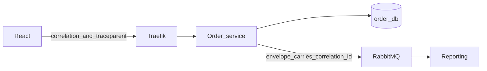

# Observability

**Status: Phase 12 wires this to Compose.** The README phase list wins where an older sentence says Phase 17. This is not a production observability stack.

Observability here means we can tell what a checkout did, how late the events are, and whether a human should act, without attaching a debugger. The four tools have separate jobs so that a dashboard outage is not a paging outage and a trace pipeline is not the metrics database.

| Tool | Job | Document |
| --- | --- | --- |
| OpenTelemetry | Traces and context propagation | [ADR-011](adr/ADR-011-why-opentelemetry.md) |
| Prometheus | Scrape and store metrics | [prometheus.md](prometheus.md), [ADR-009](adr/ADR-009-why-prometheus.md) |
| Grafana | Read metrics and traces | [grafana.md](grafana.md), [ADR-010](adr/ADR-010-why-grafana.md) |
| Alertmanager | Route alerts raised from Prometheus rules | [alerting.md](alerting.md) |

Phase 12 runs the four tools on the Compose network `commerce`, plus Tempo as the trace store Grafana reads. Checkout does not wait on them. Logs stay on container stdout. There is no retained log store, so a rotated log is gone. Odoo and the Django ORM are not auto-instrumented. The traced path is the gateway span, the order-service server span, the Postgres span, the outbox publish span, and a reporting consumer span when the message carries `traceparent`.

## Signals

**Logs.** Structured, one JSON object per line, with `correlation_id`, service name, and `event_id` when a message is in hand. Logs explain a single failure. They are a weak way to notice a slow burn, because nobody reads them continuously.

**Metrics.** Counters, gauges, and histograms. They answer "how often" and "how slow." Prometheus stores them. Golden signals at the gateway and at each service: request rate, error rate, latency. Business signals: outbox age, queue depth, DLQ depth, projection lag, payment circuit state.

**Traces.** One span per HTTP hop and per broker consume, linked by W3C `traceparent`. They answer "which hop was slow for this one request." The correlation id remains the business id stored on events, because a trace can be sampled away and the event must still point at the original request.

Sampling, when it exists, must not drop the only record of an error. A simple start is to sample successful traces and keep error traces. Phase 0 does not pretend a sampler is configured.

## Propagation

The gateway creates `X-Correlation-Id` when the caller did not send a UUID. Services copy it into logs, into the event envelope, and into the response. OpenTelemetry continues `traceparent` across HTTP. The publisher puts the trace context into message headers so the consumer span is a child, not a new mystery.

What happens without propagation: an Odoo sales order and a 500 in the order service cannot be tied together, and every incident starts with a full-text search of three log streams.

## What Phase 12 makes visible

Designed now, built later:

- Gateway request rate, 4xx, 5xx, latency.
- Order-service ready/live and database errors.
- Outbox unpublished count and oldest pending age.
- RabbitMQ queue depth for the three primary queues and the three DLQs.
- Consumer duplicate counter and handler errors.
- Reporting projection lag (newest order version minus newest projected version, as a coarse gauge).
- Payment circuit state.
- Redis errors (cache miss is not an error; connection failure is).

## Failure of the observability stack

If Prometheus is down, the business path keeps running and we lose history for the gap. Detection is "Grafana has no new samples" or a dead man's switch (an alert that fires when the scraper itself goes silent). Recovery is to restart Prometheus. A gap in metrics is not backfilled by this learning setup.

If the collector is down, traces drop. Metrics scraped directly from the process stay. That split is intentional: a tracing experiment must not be required for paging.

If logs are only on the container stdout, a restart can still be read via Docker or Kubernetes until the log rotates. Production would ship logs to a retained store. We do not run that store in Phase 0, and we should not claim we can investigate last month's incident.

> **Learning simplification.** All four tools on the Compose network, short retention, no TLS between them, no paging provider. Alerts land in Alertmanager's UI.
> **Production would require.** Retention that matches the on-call promise, a paging integration, authentication on Grafana, and a dead-man's-switch alert that does not depend on the same broken scraper without a second path.

## Related documents

- [architecture.md](architecture.md)
- [failure-scenarios.md](failure-scenarios.md)
