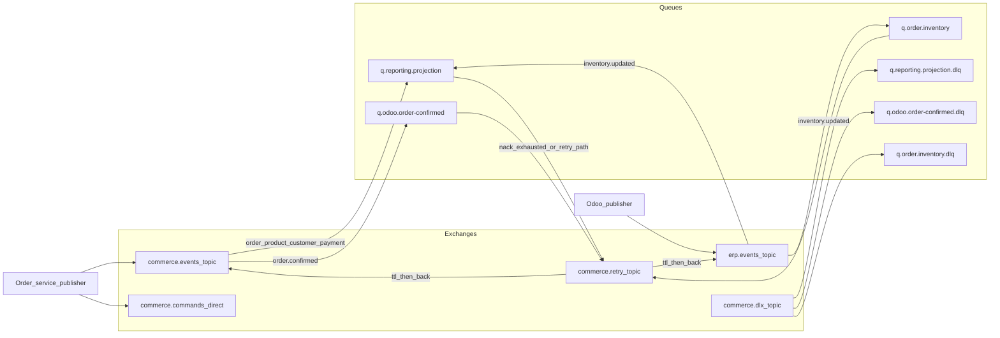

# RabbitMQ

**Status: Phase 4 declares this topology and publishes to `commerce.events` after commit. Phase 5 runs the retry ladder for the order-service inventory consumer: a failed delivery is published to `commerce.retry` and acked, and the sixth failure or a permanent failure is published to `commerce.dlx`. Primary queues still have no dead-letter argument, so `nack` with `requeue=false` would drop a message; the worker does not do that. `requeue=true` is not used. The transactional outbox is Phase 6.**

Topology name: **`commerce-platform-topology`**. Later phases should create this topology as code (definitions or a small declarative script), not by clicking in the management UI and forgetting the clicks. The protocol is AMQP 0-9-1, which is the model RabbitMQ uses for exchanges, queues, and routing keys.

## Why publish to exchanges

Producers publish to exchanges with a routing key. They do not publish to queue names.

The exchange is the stable address. Queues belong to consumers. When reporting adds a second projection, it binds a queue. The order service does not change. When Odoo is down, messages wait on Odoo's queue; the order service has already finished the HTTP request.

What happens if producers publish straight to queues: every new consumer requires a producer release, producers must know consumer deployment details, and a typo in a queue name becomes a lost message with nowhere to bind a second listener. Publishing to an exchange with the `mandatory` flag returns unroutable messages to the publisher, which then leaves the outbox row `pending` and alerts. That is a visible misconfiguration. A publish to a missing queue name fails in a way that is easier to "handle" by logging and dropping.

## Topology

All exchanges and queues are durable. Messages are persistent (`delivery_mode` 2).

### Exchanges

| Exchange | Type | Who publishes | Role |
| --- | --- | --- | --- |
| `commerce.events` | topic | order-service | Domain events in the catalog except inventory |
| `erp.events` | topic | odoo | `InventoryUpdated` only |
| `commerce.retry` | topic | broker dead-lettering, not application code | Holds a message for a TTL, then sends it back |
| `commerce.dlx` | topic | broker, after retry budget | Dead-letter landing zone |
| `commerce.commands` | direct | order-service saga | One consumer per command. Conceptual until Phase 15 |

Two event exchanges exist so Odoo's credentials can be granted publish rights on `erp.events` and not on `commerce.events`. A bug in the module then cannot forge `OrderConfirmed`.

### Routing keys

| Key | Event |
| --- | --- |
| `order.created` | `OrderCreated` |
| `order.confirmed` | `OrderConfirmed` |
| `order.cancelled` | `OrderCancelled` |
| `order.processing-started` | `OrderProcessingStarted` |
| `order.shipped` | `OrderShipped` |
| `order.delivered` | `OrderDelivered` |
| `product.created` | `ProductCreated` |
| `product.updated` | `ProductUpdated` |
| `customer.updated` | `CustomerUpdated` |
| `payment.confirmed` | `PaymentConfirmed` |
| `payment.failed` | `PaymentFailed` |
| `inventory.updated` | `InventoryUpdated` |

Keys are the contract. Queue names are not.

### Bindings

| Queue | Source | Binding | Consumer |
| --- | --- | --- | --- |
| `q.reporting.projection` | `commerce.events` | `order.*`, `product.*`, `customer.*`, `payment.*` | reporting workers |
| `q.reporting.projection` | `erp.events` | `inventory.updated` | reporting workers |
| `q.odoo.order-confirmed` | `commerce.events` | `order.confirmed` | Odoo connector |
| `q.order.inventory` | `erp.events` | `inventory.updated` | order-service inventory worker |

`q.odoo.order-confirmed` has no binding for `order.created`, `order.cancelled`, or payment keys. That is how "Odoo receives only confirmed orders" is enforced in the broker, not only in a wiki.

One queue may have several bindings. Reporting uses that so a single consumer loop and a single dedup table see every fact.

### Saga commands (conceptual, Phase 15)

Not domain events. Direct exchange `commerce.commands`:

| Routing key | Queue | Consumer |
| --- | --- | --- |
| `inventory.reserve` | `q.odoo.reserve-inventory` | Odoo |
| `inventory.release` | `q.odoo.release-inventory` | Odoo |
| `erp.create-sales-order` | `q.odoo.create-sales-order` | Odoo |
| `erp.cancel-sales-order` | `q.odoo.cancel-sales-order` | Odoo |

Commands are imperative and have one consumer group. They still go through an exchange so retries and dead letters work the same way, and so the saga publisher does not embed queue names. Command bodies reuse the envelope fields (`event_id`, `correlation_id`, `causation_id`, and the rest) with `event_type` set to `ReserveInventory`, `ReleaseInventory`, `CreateErpOrder`, or `CancelErpOrder`. Reporting must not bind to `commerce.commands`.

Fulfillment milestones are not on this exchange. Odoo calls private HTTP on the order service so an illegal transition returns 409 to the caller. See [architecture.md](architecture.md).

## At least once

Delivery is at least once. The path is:

1. The business transaction inserts the outbox row and commits.
2. The publisher sends the body to the exchange and waits for a broker confirm.
3. Only then does it set `published_at` and `status = published`.
4. The consumer handles the message and writes its own database.
5. Only then does it ack.

A crash after step 2 and before step 3 republishes. A crash after the consumer's commit and before ack redelivers. Both are normal. Consumers must be idempotent. See [idempotency.md](idempotency.md) and [outbox.md](outbox.md).

The broker is not configured for exactly-once. RabbitMQ will not dedupe by `event_id` for us. Pretending otherwise creates double ERP orders the first time a process is killed.

Publisher settings that matter: persistent messages, publisher confirms, `mandatory` so an unroutable message is an error, and `message_id` equal to `event_id`.

Consumer settings that matter: manual ack, prefetch small enough to reason about (start at 10), and `nack` with `requeue = false` on a handled failure so the retry topology runs. `requeue = true` on a poison message hot-loops the CPU and blocks the queue.

## Competing consumers

Several workers may listen to `q.reporting.projection`. RabbitMQ will give each message to one of them. That scales throughput and removes per-queue order.

So:

- Handlers must be safe under redelivery (idempotency).
- Handlers that care about order must use `aggregate_version`, described in [events.md](events.md).
- Early implementation may run one consumer. That is a learning default, not a license to skip version checks. The checks are cheap and are the real design.

Odoo's confirmed-order queue can also have competing consumers inside Odoo. Creating the sales order must be idempotent on the commerce `order_id`, because two workers must not create two sales orders for one event.

## Retry, backoff, and dead letters

Automatic retries: **5**. Backoff TTLs:

| Attempt after failure | Delay |
| --- | --- |
| 1 | 5 seconds |
| 2 | 30 seconds |
| 3 | 2 minutes |
| 4 | 10 minutes |
| 5 | 30 minutes |
| 6th failure | Dead letter, no further automatic retry |

How the plumbing works, per primary queue:

1. The worker fails the handler and `nack`s with `requeue = false`.
2. The message dead-letters to `commerce.retry` with a header `x-retry-count`.
3. A retry queue for that count holds the message for the TTL above. Its own dead-letter settings point back at the original exchange and routing key.
4. When the count would exceed 5, the message is published to `commerce.dlx` with a routing key that lands on that consumer's DLQ.

DLQs:

| Queue | Bound from |
| --- | --- |
| `q.reporting.projection.dlq` | `commerce.dlx` |
| `q.odoo.order-confirmed.dlq` | `commerce.dlx` |
| `q.order.inventory.dlq` | `commerce.dlx` |

Nothing consumes a DLQ automatically. Depth greater than zero is a page. A human fixes the bug or the payload, then republishes to the original exchange (a shovel or a small replay tool in a later phase) or discards with a written reason.

Phase 5 follows that budget. The worker sets `x-retry-count` itself, because a `nack` cannot add the header and cannot choose attempt 1 versus attempt 5. It publishes to `commerce.retry` with routing key `{prefix}.retry.{attempt}`, confirms, then acks the original. Each retry queue's TTL dead-letters back to the original exchange under that same retry key, and the main queue is bound to those keys. A permanent failure (malformed body, unknown event type, schema version the consumer does not understand, payload that can never apply) is published to `commerce.dlx` without spending the five delays. An older inventory snapshot is acked and ignored.

What this solves: a one-second Odoo outage should not require a human, and a corrupt payload should not spin forever.

What happens without a max: the retry queue grows for a message that will never succeed, and fresh messages wait behind it if you were unwise enough to use a single ordered consumer. The DLQ is how we stop the bleeding and keep the main queue moving.

Detection: DLQ depth, retry queue depth, and consumer exception logs that include `event_id` and `correlation_id`. Recovery: fix, then replay. Do not "fix" a poison order event by editing `reporting_db` to match a guess and acking the DLQ without a record.

A consumer that cannot apply version N+1 because N is missing uses this same retry path. Five gaps that close within the backoff window succeed. A permanent gap becomes a DLQ entry, which is what we want.

> **Learning simplification.** One broker node, classic durable queues, TTLs as above, definitions checked into the repo when Phase 8 starts.
> **Production would require.** Quorum queues, a disk and memory alarm plan, mirrored or clustered brokers, and a tested replay tool. Lazy queues or a delay plugin are optional; the TTL retry queues are enough to teach the idea and are valid in production at this volume.

## Failure and scale

| Failure | What users see | Detection | Recovery |
| --- | --- | --- | --- |
| Broker down | Checkout still commits. Integration pauses. | Outbox oldest age, broker health | Restore broker, publisher drains |
| Wrong binding | Confirm works, Odoo stays quiet | `mandatory` returns, or a queue that never grows | Fix the binding, republish pending rows |
| Consumer throws | That message retries, then DLQ | DLQ depth | Fix handler, replay |
| Slow consumer | Queues grow, reports lag | Queue depth, consumer lag | Add competing consumers only with version gates; or speed the handler |
| Disk full | Publishers block or fail confirms | Broker disk alarm, outbox age | Free disk, restore service, drain outbox |

Scale path: competing consumers for reporting; partition the outbox publisher by aggregate when one publisher's confirm rate saturates; move to quorum queues when losing one broker node must not lose acknowledged messages. None of that is built in Phase 0.

## Related documents

- [events.md](events.md)
- [outbox.md](outbox.md)
- [idempotency.md](idempotency.md)
- [ADR-003](adr/ADR-003-why-rabbitmq.md)
